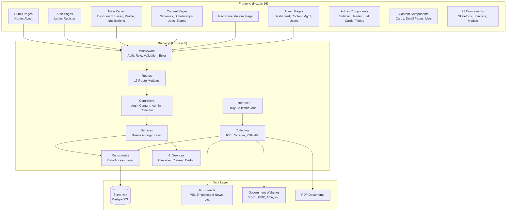
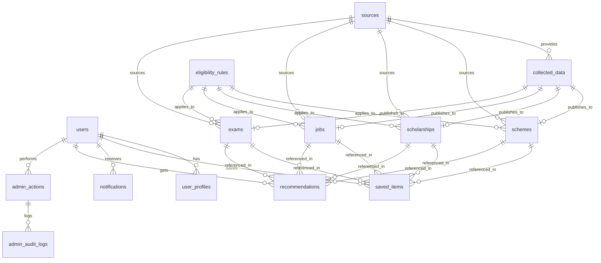
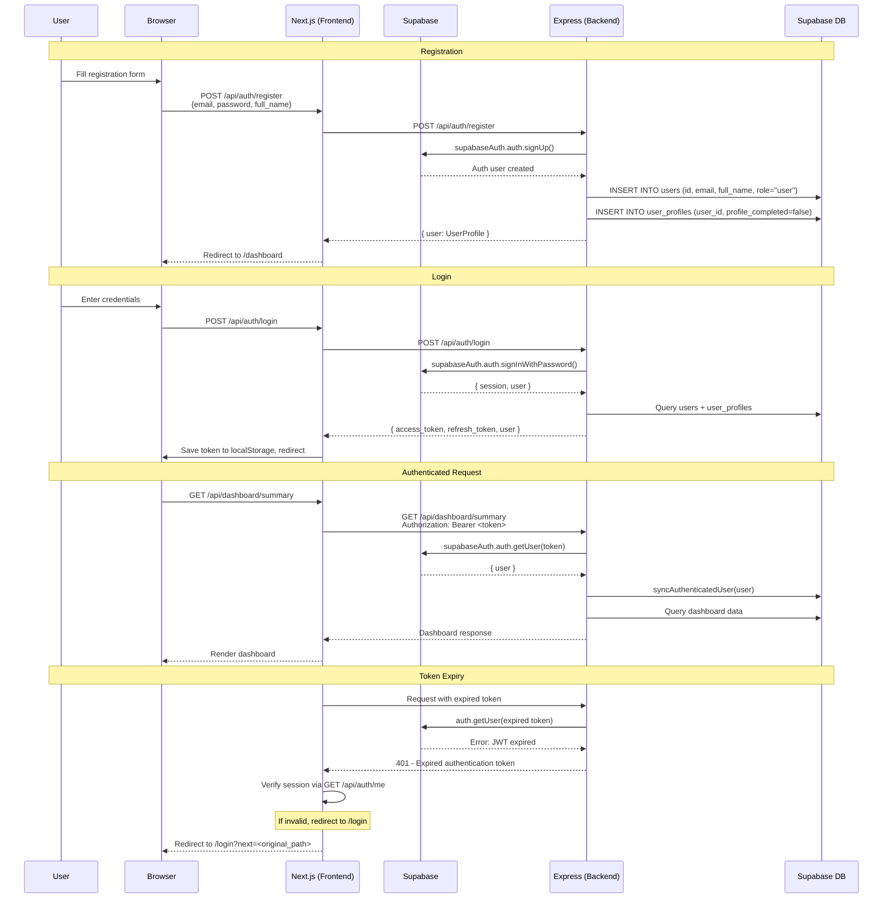
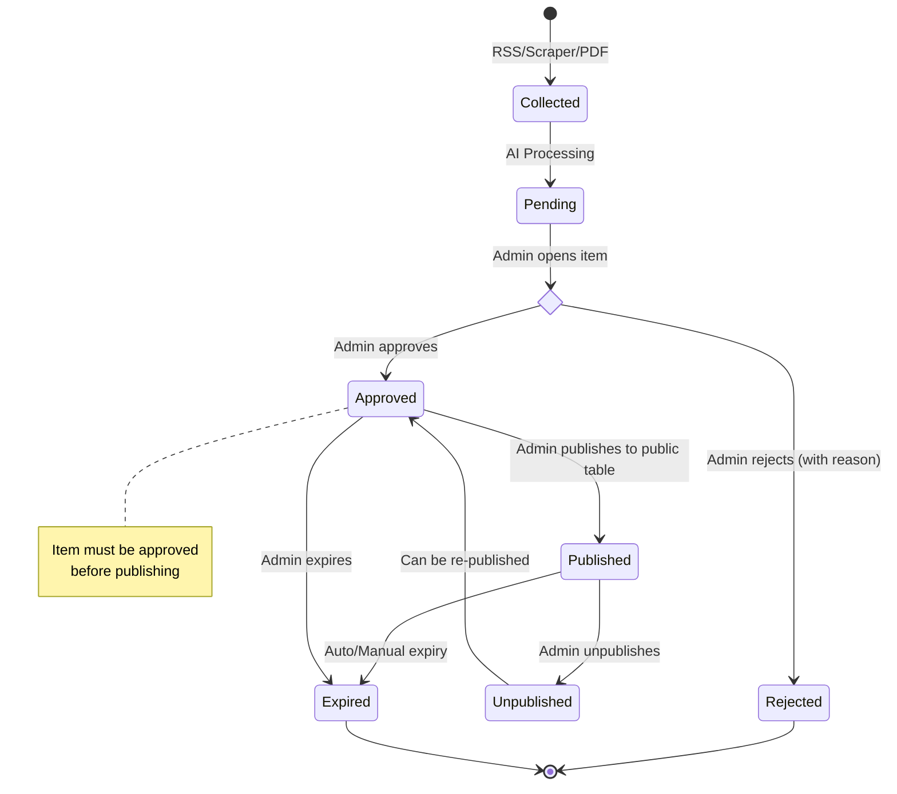
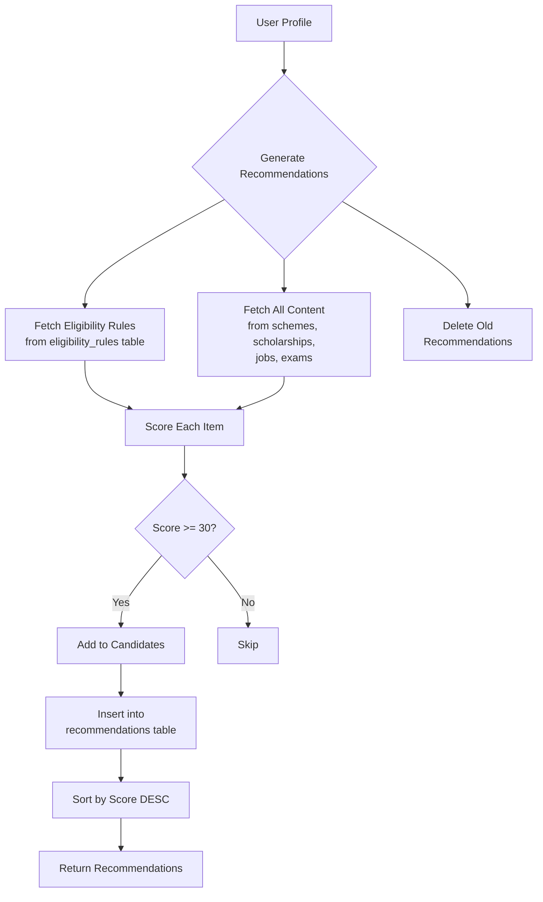
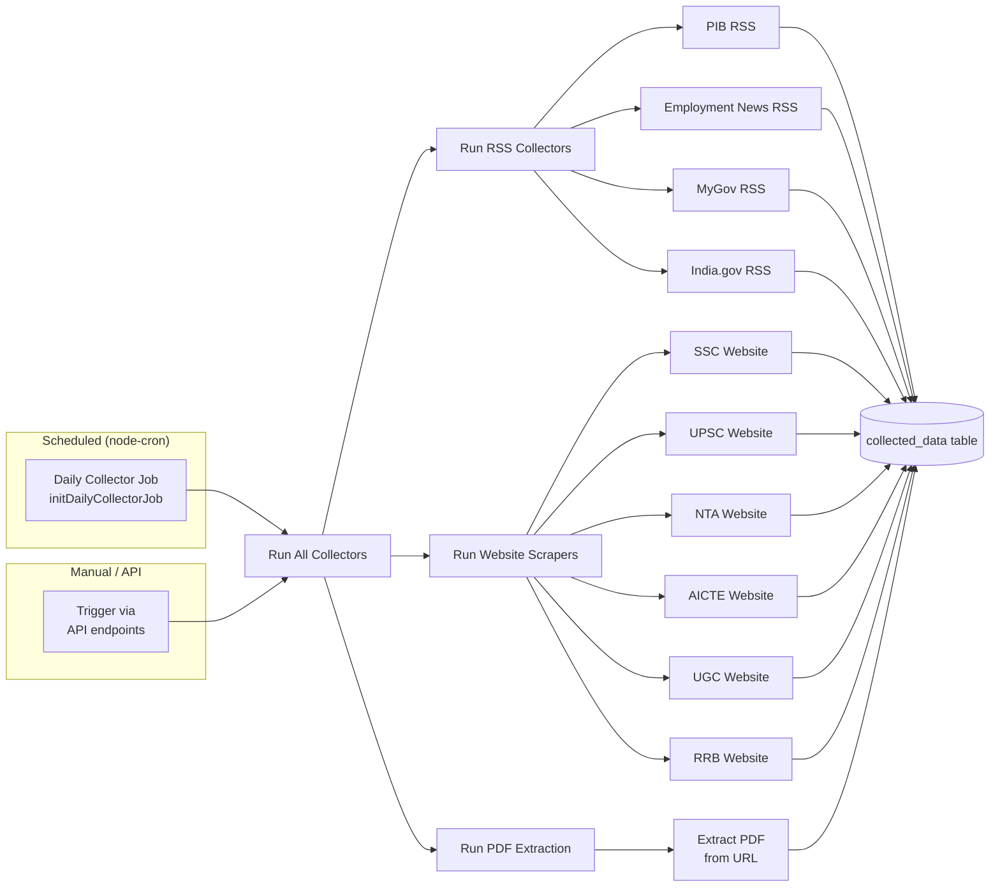

# BharatLens — Complete Codebase Documentation

> **Version:** 1.1.0  
> **Stack:** Next.js 16 (Frontend) + Express 5 (Backend) + Supabase (Database/Auth)  
> **Last Updated:** June 2026
> 
> **Status:** ✅ Fully stabilized — TypeScript clean, lint clean, security hardened, duplicate routes removed, dead code eliminated, all controllers standardized to consistent response format. Ready for production deployment and future AI integration.

---

## Table of Contents

1. [Project Overview](#1-project-overview)
2. [System Architecture](#2-system-architecture)
3. [Folder Structure](#3-folder-structure)
4. [Frontend Documentation](#4-frontend-documentation)
5. [Backend Documentation](#5-backend-documentation)
6. [API Documentation](#6-api-documentation)
7. [Database Schema](#7-database-schema)
8. [Authentication Flow](#8-authentication-flow)
9. [Admin Workflow](#9-admin-workflow)
10. [Recommendation Engine](#10-recommendation-engine)
11. [Data Collection Workflow](#11-data-collection-workflow)
12. [AI Services](#12-ai-services)
13. [Deployment Guide](#13-deployment-guide)
14. [Security Analysis](#14-security-analysis)
15. [Performance Analysis](#15-performance-analysis)
16. [Testing Status](#16-testing-status)
17. [Known Issues & Technical Debt](#17-known-issues--technical-debt)
18. [Future Roadmap](#18-future-roadmap)

---

## 1. Project Overview

BharatLens is an AI-powered discovery platform that provides verified information about Indian government schemes, scholarships, jobs, and exams. It aggregates data from multiple official government sources (RSS feeds, scraping, PDFs), classifies and cleans the data, and surfaces personalized recommendations through an AI-based eligibility matching engine.

### Core Value Proposition

- **Centralized Discovery:** Aggregates schemes, scholarships, jobs, and exams from PIB, Employment News, MyGov, India.gov, SSC, UPSC, NTA, AICTE, UGC, RRB, and Data.gov
- **AI-Powered Personalization:** Profile-based recommendation engine that matches users to relevant opportunities
- **Verified Content Pipeline:** Admin moderation workflow with approval, rejection, and publishing stages
- **Multi-platform Access:** Responsive web interface with both user-facing and admin-facing panels

### Key Technologies

| Layer | Technology | Version |
|---|---|---|
| **Frontend Framework** | Next.js | 16.2.6 |
| **UI Library** | React | 19.2.4 |
| **Styling** | Tailwind CSS | v4 |
| **Animations** | Framer Motion | 12.40.0 |
| **Icons** | Lucide React | 1.16.0 |
| **Backend Framework** | Express | 5.2.1 |
| **Database** | Supabase (PostgreSQL) | — |
| **Auth** | Supabase Auth | — |
| **Validation** | Zod | 4.4.3 |
| **RSS Parsing** | rss-parser | 3.13.0 |
| **Web Scraping** | Cheerio + Axios | 1.2.0 / 1.17.0 |
| **PDF Parsing** | pdf-parse | 2.4.5 |
| **Task Scheduling** | node-cron | 4.2.1 |
| **Security** | Helmet | 8.2.0 |

---

## 2. System Architecture



### Architecture Principles

1. **Layered Backend:** Routes → Controllers → Services → Repositories → Supabase
2. **Rate Limited:** Three tiers — 100 req/min general API, 10 req/min auth, 30 req/min admin
3. **Security Headers:** Strict CSP, frame-src denied, CORS restricted, request size limited to 1MB
4. **Production-Safe Errors:** 500 errors return generic messages in production; full details logged server-side
5. **Client-side Rendering:** Most pages use `"use client"` for interactivity
6. **Token-based Auth:** JWT tokens managed through Supabase Auth with bearer tokens
7. **Admin Isolation:** Separate layout and sidebar with role-based access
8. **Data Pipeline:** External sources → Collectors → `collected_data` table → Verification → Public tables

---

## 3. Folder Structure

```
BharatLens/
├── frontend/                          # Next.js 16 Frontend
│   ├── app/                          # App Router Pages
│   │   ├── layout.tsx                # Root layout w/ AuthProvider & AppShell
│   │   ├── page.tsx                  # Landing page
│   │   ├── globals.css               # Tailwind + custom CSS
│   │   ├── (main)/layout.tsx         # Authenticated layout w/ profile check
│   │   ├── (auth)/layout.tsx         # Auth layout (login/register)
│   │   ├── (main)/dashboard/page.tsx # User dashboard
│   │   ├── (main)/saved/page.tsx     # Saved items
│   │   ├── (main)/profile/page.tsx   # User profile
│   │   ├── (main)/notifications/page.tsx
│   │   ├── (main)/recommendations/page.tsx
│   │   ├── (main)/schemes/page.tsx   # Schemes listing
│   │   ├── (main)/schemes/[id]/page.tsx # Scheme detail
│   │   ├── (main)/scholarships/page.tsx
│   │   ├── (main)/scholarships/[id]/page.tsx
│   │   ├── (main)/jobs/page.tsx
│   │   ├── (main)/jobs/[id]/page.tsx
│   │   ├── (main)/exams/page.tsx
│   │   ├── (main)/exams/[id]/page.tsx
│   │   ├── admin/layout.tsx          # Admin layout w/ sidebar & role check
│   │   └── admin/page.tsx            # Admin dashboard
│   ├── components/                   # React Components
│   │   ├── auth/                     # AuthProvider, OriginGuard
│   │   ├── layout/                   # AppShell, SiteHeader, SiteFooter
│   │   ├── admin/                    # AdminSidebar, AdminHeader, AdminStatCard
│   │   ├── cards/                    # SchemeCard, JobCard, ExamCard, etc.
│   │   ├── details/                  # DetailPage, DetailHero, EligibilityList, etc.
│   │   └── ui/skeletons/            # Loading skeletons
│   ├── hooks/                        # Custom hooks (useAuth, useProfile, useSavedItems)
│   ├── lib/                          # API & utilities
│   │   ├── api/                      # API clients (client, auth-api, content-api, etc.)
│   │   ├── auth/                     # Auth utilities (urls, storage, safe-origin)
│   │   ├── supabase/                 # Supabase client (client.ts, server.ts)
│   │   └── types/                    # Shared type definitions
│   ├── types/                        # TypeScript type definitions
│   ├── utils/                        # Utility functions (cn, formatDate, filterItems)
│   ├── proxy.ts                      # Next.js middleware for auth protection
│   ├── next.config.ts                # Next.js config
│   └── package.json                  # Frontend dependencies
│
├── backend/                          # Express 5 Backend
│   ├── src/
│   │   ├── server.ts                 # Server entry point
│   │   ├── app.ts                    # Express app configuration
│   │   ├── config/                   # Configuration files
│   │   │   ├── env.ts                # Zod-validated environment variables
│   │   │   ├── supabase.ts           # Supabase client setup
│   │   │   └── collector.config.ts   # Collector source definitions
│   │   ├── routes/                   # Express routers (17 modules)
│   │   ├── controllers/             # Request handlers (16 modules)
│   │   ├── services/                 # Business logic (14 modules)
│   │   ├── repositories/            # Data access layer (12 modules)
│   │   ├── middlewares/              # Express middleware
│   │   ├── validators/              # Zod validation schemas
│   │   ├── collectors/              # Data collectors
│   │   │   ├── rss/                  # RSS feed collectors
│   │   │   ├── scraping/             # Website scrapers
│   │   │   ├── pdf/                  # PDF extractors
│   │   │   └── apis/                 # External API collectors
│   │   ├── ai/                       # AI services
│   │   ├── jobs/                     # Scheduled jobs (daily collector)
│   │   ├── types/                    # TypeScript types
│   │   ├── utils/                    # Utilities
│   │   ├── constants/               # Status constants
│   │   └── docs/                     # OpenAPI spec
│   └── tests/                        # Backend tests
│       └── controllers/              # Controller tests
│
├── .gitignore
├── .vscode/                          # VS Code settings
├── AGENTS.md                         # AI agent configuration
├── CLAUDE.md                         # AI assistant rules
└── README.md
```

---

## 4. Frontend Documentation

### 4.1 Pages & Routing

The application uses Next.js App Router with the following route groups:

| Route Group | Path | Purpose | Auth Required | Layout |
|---|---|---|---|---|
| **Public** | `/` | Landing page | No | AppShell |
| | `/about` | About page | No | AppShell |
| **Auth** | `/login` | Login form | No (redirects if authenticated) | AuthLayout |
| | `/register` | Registration form | No (redirects if authenticated) | AuthLayout |
| **Main** | `/dashboard` | User dashboard | Yes + profile check | MainLayout |
| | `/profile` | View profile | Yes | MainLayout |
| | `/profile/setup` | Profile setup wizard | Yes | MainLayout |
| | `/saved` | Saved items | Yes | MainLayout |
| | `/notifications` | Notifications list | Yes | MainLayout |
| | `/recommendations` | AI recommendations | Yes | MainLayout |
| | `/schemes` | Schemes listing | Yes | MainLayout |
| | `/schemes/[id]` | Scheme detail | Yes | MainLayout |
| | `/scholarships` | Scholarship listing | Yes | MainLayout |
| | `/scholarships/[id]` | Scholarship detail | Yes | MainLayout |
| | `/jobs` | Jobs listing | Yes | MainLayout |
| | `/jobs/[id]` | Job detail | Yes | MainLayout |
| | `/exams` | Exams listing | Yes | MainLayout |
| | `/exams/[id]` | Exam detail | Yes | MainLayout |
| **Admin** | `/admin` | Admin dashboard | Yes + admin/moderator role | AdminLayout |
| | `/admin/*` | Admin subpages | Yes + admin/moderator role | AdminLayout |

### 4.2 Layout Architecture

```
RootLayout (app/layout.tsx)
├── AuthProvider
│   ├── OriginGuard
│   └── AppShell (components/layout/AppShell.tsx)
│       ├── SiteHeader (hidden on /admin, /login, /register)
│       ├── Main Content (flex-1)
│       │   ├── (main)/layout.tsx     ← Profile check, redirect if not auth'd
│       │   │   └── Page content
│       │   ├── (auth)/layout.tsx     ← Redirect if auth'd
│       │   │   └── Auth forms
│       │   └── admin/layout.tsx      ← Role check, sidebar
│       │       └── Admin content
│       └── SiteFooter (hidden on same pages as header)
```

### 4.3 Key Components

#### Layout Components
- **`AppShell.tsx`** (`frontend/components/layout/AppShell.tsx`): Conditionally renders header/footer based on route
- **`SiteHeader.tsx`** (`frontend/components/layout/SiteHeader.tsx`): Sticky navigation with scroll effect, explore dropdown, profile dropdown, mobile menu
- **`SiteFooter.tsx`** (`frontend/components/layout/SiteFooter.tsx`): Footer with brand, explore links, resource links

#### Auth Components
- **`AuthProvider.tsx`** (`frontend/components/auth/AuthProvider.tsx`): React context for Supabase session management, handles token save/clear, sign out, session refresh
- **`OriginGuard.tsx`** (`frontend/components/auth/OriginGuard.tsx`): Redirects users from `0.0.0.0` to `localhost` to fix OAuth PKCE state issues

#### Admin Components
- **`AdminSidebar.tsx`** (`frontend/components/admin/AdminSidebar.tsx`): Admin navigation sidebar
- **`AdminHeader.tsx`** (`frontend/components/admin/AdminHeader.tsx`): Admin top header with mobile menu toggle
- **`AdminStatCard.tsx`** (`frontend/components/admin/AdminStatCard.tsx`): Statistics display card

#### Card Components
- **`SchemeCard.tsx`**, **`ScholarshipCard.tsx`**, **`JobCard.tsx`**, **`ExamCard.tsx`**: Content listing cards with save/bookmark functionality
- **`SavedItemCard.tsx`** (`frontend/components/cards/SavedItemCard.tsx`): Card for saved items with remove capability

#### Detail Components
- **`DetailPage.tsx`** (`frontend/components/details/DetailPage.tsx`): Generic detail page wrapper
- **`DetailHero.tsx`**: Hero section for detail pages
- **`EligibilityList.tsx`**: Eligibility criteria display
- **`InfoSection.tsx`**: Information sections
- **`DocumentsList.tsx`**: Required documents display
- **`TimelineSection.tsx`**: Timeline view for dates
- **`RelatedCards.tsx`**: Related opportunities
- **`DetailSidebar.tsx`**: Sidebar with actions (save, share, apply)

#### UI Components
- **Skeletons**: `DashboardSkeleton.tsx`, `CardSkeleton.tsx`, `ListSkeleton.tsx`, `PageSkeleton.tsx`
- **`Spinner.tsx`**: Loading spinner

### 4.4 Hooks

| Hook | File | Purpose |
|---|---|---|
| `useAuth` | `frontend/hooks/useAuth.ts` | Wraps AuthContext for authentication state |
| `useProfile` | (removed) | Removed — dead hook; profile data fetched via API directly |
| `useSavedItems` | (removed) | Removed — dead hook; saved items fetched via API directly |

### 4.5 API Client Architecture

The frontend uses a centralized API client (`frontend/lib/api/client.ts`) that:

1. Automatically retrieves auth tokens from Supabase session or localStorage fallback
2. Handles standardized response format `{ success, message, data, pagination }`
3. Manages 401 errors with session verification and redirect to login
4. Supports "optional" mode (returns `undefined` instead of throwing on failure)
5. Supports "rawResponse" mode for accessing full response object including pagination

### 4.6 Styling

- **Tailwind CSS v4** with custom CSS variables in `globals.css`
- Custom color palette: `--bl-navy: #1a3c6e`, `--bl-accent: #3b82f6`, `--bl-sand: #f5f3ee`
- Consistent design language: rounded cards, shadows, hover transitions, backdrop blur
- Responsive design with mobile-first breakpoints
- Custom scrollbar styling
- Animations via CSS transitions and keyframes (no over-reliance on Framer Motion despite dependency)

---

## 5. Backend Documentation

### 5.1 Application Entry Point

**`backend/src/server.ts`** — Starts Express server on configured PORT (default 5001).

**`backend/src/app.ts`** — Configures:
- Security middleware (Helmet)
- CORS (Frontend URL + localhost:3001)
- JSON body parsing (1MB limit)
- Logging (Morgan)
- 17 route modules mounted under `/api`
- Health check endpoints (`/` and `/api/health`)
- Daily collector cron job initialization
- 404 handler + global error handler

### 5.2 Middleware Stack

| Middleware | File | Purpose |
|---|---|---|
| `requireAuth` | `backend/src/middlewares/auth.middleware.ts` | Extracts Bearer token, verifies with Supabase, syncs user record |
| `requireRole` | `backend/src/middlewares/role.middleware.ts` | Role-based access (`admin`, `moderator`) |
| `validate` | `backend/src/middlewares/validate.middleware.ts` | Zod schema validation for params/body/query |
| `injectItemType` | `backend/src/middlewares/inject-item-type.middleware.ts` | Converts plural URL paths to singular item types (`schemes` → `scheme`) |
| `errorHandler` | `backend/src/middlewares/error.middleware.ts` | Global error handler for AppError, ZodError, generic errors |
| `notFoundHandler` | `backend/src/middlewares/not-found.middleware.ts` | 404 handler for unknown routes |

### 5.3 Route Modules (17)

All routes are mounted under `/api` in `app.ts`:

| Route Prefix | File | Auth Required | Key Endpoints |
|---|---|---|---|
| `/api/auth` | `auth.routes.ts` | Partial | Register, Login, Logout, Me, Update Profile |
| `/api/schemes` | `scheme.routes.ts` | No | List (paginated/filtered), Get by ID |
| `/api/scholarships` | `scholarship.routes.ts` | No | List, Get by ID |
| `/api/jobs` | `job.routes.ts` | No | List, Get by ID |
| `/api/exams` | `exam.routes.ts` | No | List, Get by ID |
| `/api/search` | `search.routes.ts` | No | Search across all content types |
| `/api/eligibility` | `eligibility.routes.ts` | No | Check eligibility |
| `/api/recommendations` | `recommendation.routes.ts` | Yes | List, Generate, By Type, Mark Viewed |
| `/api/profile` | `profile.routes.ts` | Yes | Get own, Update, Create |
| `/api/notifications` | `notifications.routes.ts` | Yes | List, Unread count, Mark read, Delete |
| `/api/saved` | `saved.routes.ts` | Yes | List, Save, Remove, Check |
| `/api/dashboard` | `dashboard.routes.ts` | Yes | Dashboard summary |
| `/api/admin` | `admin.routes.ts` | Yes + Admin/Mod | Stats, Users, Sources, Items CRUD, Collected data workflow |
| `/api/collectors` | `collector.routes.ts` | No | Status, Stats, Run collectors |
| `/api/pdf` | `pdf.routes.ts` | No | Extract PDF text |
| `/api/docs` | `docs.routes.ts` | No | OpenAPI spec |
| `/api/test-db` | `test.route.ts` | No (dev only) | Database connectivity test (only in dev) |

### 5.4 Controller Layer

Each controller delegates to a service and handles request/response formatting. Key patterns:
- Uses `asyncHandler` wrapper to catch async errors
- Uses `sendSuccess` / `sendError` helpers for consistent responses
- Validated inputs accessed via `req.validatedBody`, `req.validatedParams`, `req.validatedQuery`
- Authenticated user accessed via `req.user`

### 5.5 Service Layer

Services contain business logic and orchestrate repository calls. All services are in `backend/src/services/`:

| Service | Key Functions |
|---|---|
| `auth.service.ts` | registerNewUser, loginUser, fetchUserProfile, logoutUser, updateUserProfile |
| `scheme.service.ts` | fetchAllSchemes, fetchSchemeById |
| `scholarship.service.ts` | fetchAllScholarships, fetchScholarshipById |
| `job.service.ts` | fetchAllJobs, fetchJobById |
| `exam.service.ts` | fetchAllExams, fetchExamById |
| `search.service.ts` | performSearch (loads all content, filters by query, paginates) |
| `eligibility.service.ts` | determineEligibility (rule-based scoring) |
| `recommendation.service.ts` | getRecommendations, generateRecommendations, viewRecommendation |
| `profile.service.ts` | fetchProfile, modifyProfile |
| `dashboard.service.ts` | getDashboardSummary (aggregated counts, profile, recommendations, notifications, updates) |
| `notifications.service.ts` | fetchUserNotifications, readNotification, markReadAll, deleteNotification |
| `saved-items.service.ts` | fetchSavedItems, saveItem, deleteSavedItem, checkSavedItem |
| `admin.service.ts` | Extensive CRUD for content items, collected data workflow (approve, reject, publish, unpublish, delete, edit) |
| `collector.service.ts` | RSS/Scraper/PDF collection orchestration, stats, text processing |

### 5.6 Repository Layer

Repositories interact directly with Supabase. All repositories are in `backend/src/repositories/`:

| Repository | Key Functions | Table(s) |
|---|---|---|
| `auth.repository.ts` | registerUser, authenticateUser, findUserById, signOutUser, updateUserProfile, syncAuthenticatedUser | `users`, `user_profiles` |
| `scheme.repository.ts` | getAllSchemes (paginated/filtered/sorted/search), getSchemeById | `schemes` |
| `scholarship.repository.ts` | getAllScholarships, getScholarshipById | `scholarships` |
| `job.repository.ts` | getAllJobs, getJobById | `jobs` |
| `exam.repository.ts` | getAllExams, getExamById | `exams` |
| `admin.repository.ts` | CRUD for admin items, stats, users, sources, audit logs | `schemes`, `scholarships`, `jobs`, `exams`, `users`, `sources`, `admin_actions` |
| `search.repository.ts` | searchAll (loads all content, maps to unified format) | `schemes`, `scholarships`, `jobs`, `exams` |
| `eligibility.repository.ts` | evaluateEligibility (rule-based) | In-memory |
| `recommendation.repository.ts` | fetchRecommendations, generateRecommendationsForUser, markRecommendationViewed | `recommendations`, `eligibility_rules`, `schemes`, `scholarships`, `jobs`, `exams` |
| `collected-data.repository.ts` | CRUD for collected data, dedup check, bulk insert, source management | `collected_data`, `sources` |
| `saved-items.repository.ts` | listSavedItems, addSavedItem, removeSavedItem, findSavedItem | `saved_items` |
| `notifications.repository.ts` | getNotificationsForUser, markNotificationAsRead, markAllNotificationsRead, deleteNotification, countUnreadNotifications | `notifications` |
| `audit.repository.ts` | insertAdminAuditLog | `admin_audit_logs` |

### 5.7 Validation Layer (Zod Schemas)

All validators are in `backend/src/validators/`:

| Validator | Purpose |
|---|---|
| `query.validator.ts` | Pagination, sorting, filtering, search parameters |
| `auth.validator.ts` | Registration, login, profile update, user ID param |
| `admin.validator.ts` | Item params, review body, publish body, collected data edit, user role update |
| `common.validator.ts` | Generic ID param |
| `eligibility.validator.ts` | Eligibility check input |
| `notifications.validator.ts` | Notification ID, query params |
| `profile.validator.ts` | Profile creation and update with field normalization |
| `recommendation.validator.ts` | Recommendation queries, ID params |
| `saved-items.validator.ts` | Save item body, check params, user ID params |
| `search.validator.ts` | Search query params |

---

## 6. API Documentation

### 6.1 Standard Response Format

```json
{
  "success": true,
  "message": "Schemes fetched successfully",
  "data": [...],
  "pagination": {
    "page": 1,
    "limit": 10,
    "total": 100,
    "totalPages": 10,
    "hasNextPage": true,
    "hasPreviousPage": false
  }
}
```

Error responses:
```json
{
  "success": false,
  "message": "Invalid authentication token",
  "error": "Expired authentication token"
}
```

### 6.2 Complete API Endpoint Reference

#### Authentication Endpoints

| Method | Path | Auth | Description |
|---|---|---|---|
| `POST` | `/api/auth/register` | No | Register new user |
| `POST` | `/api/auth/login` | No | Login with email/password |
| `POST` | `/api/auth/logout` | Yes | Logout current session |
| `GET` | `/api/auth/me` | Yes | Get current user profile |
| `PATCH` | `/api/auth/profile` | Yes | Update own profile |
| `GET` | `/api/auth/:id` | No | Get user profile by ID |

#### Content Endpoints (Public)

| Method | Path | Auth | Description |
|---|---|---|---|
| `GET` | `/api/schemes` | No | List schemes (paginated, filtered, sorted) |
| `GET` | `/api/schemes/:id` | No | Get scheme by ID |
| `GET` | `/api/scholarships` | No | List scholarships |
| `GET` | `/api/scholarships/:id` | No | Get scholarship by ID |
| `GET` | `/api/jobs` | No | List jobs |
| `GET` | `/api/jobs/:id` | No | Get job by ID |
| `GET` | `/api/exams` | No | List exams |
| `GET` | `/api/exams/:id` | No | Get exam by ID |

**Content List Query Parameters:**
- `page` (number, default 1)
- `limit` (number, default 10, max 100)
- `search` (string, searches title/description/search_text)
- `state` (string filter)
- `category` (string filter)
- `sortBy` (`created_at` | `updated_at` | `deadline` | `title`)
- `sortOrder` (`asc` | `desc`, default `desc`)

#### Search & Eligibility

| Method | Path | Auth | Description |
|---|---|---|---|
| `GET` | `/api/search` | No | Search across all content types |
| `POST` | `/api/eligibility` | No | Check eligibility (rule-based) |

**Search Parameters:** `query`, `page`, `limit`

**Eligibility Body:**
```json
{
  "age": 25,
  "state": "Maharashtra",
  "income": 300000,
  "education": "Graduate",
  "occupation": "Student"
}
```

#### Recommendations (Auth Required)

| Method | Path | Description |
|---|---|---|
| `GET` | `/api/recommendations` | List recommendations (paginated) |
| `POST` | `/api/recommendations/generate` | Generate/regenerate recommendations |
| `GET` | `/api/recommendations/:itemType` | Get recommendations by type |
| `PATCH` | `/api/recommendations/:id/viewed` | Mark recommendation as viewed |

#### Profile (Auth Required)

| Method | Path | Description |
|---|---|---|
| `GET` | `/api/profile/me` | Get own profile |
| `GET` | `/api/profile` | Get own profile |
| `POST` | `/api/profile` | Create profile |
| `PUT` | `/api/profile` | Update profile |
| `PATCH` | `/api/profile` | Update profile |
| `GET` | `/api/profile/:id` | Get profile by ID |

**Note:** There are redundant routes (`/profile` and `/auth/profile`) for profile management — a bug/duplication.

#### Notifications (Auth Required)

| Method | Path | Description |
|---|---|---|
| `GET` | `/api/notifications` | List notifications |
| `GET` | `/api/notifications/unread-count` | Get unread count |
| `PATCH` | `/api/notifications/:id/read` | Mark notification as read |
| `PATCH` | `/api/notifications/read-all` | Mark all as read |
| `DELETE` | `/api/notifications/:id` | Delete notification |

#### Saved Items (Auth Required)

| Method | Path | Description |
|---|---|---|
| `GET` | `/api/saved` | List saved items |
| `POST` | `/api/saved` | Save an item |
| `DELETE` | `/api/saved/:id` | Remove saved item by ID |
| `DELETE` | `/api/saved/item/:itemType/:itemId` | Remove saved item by item |
| `GET` | `/api/saved/:itemType/:itemId/check` | Check if item is saved |

**Note:** Previously there were duplicate routes (`/api/saved` and `/api/saved-items`). The duplicate was resolved — `/api/saved` is now the single source of truth; `/api/saved-items` was removed.

#### Dashboard (Auth Required)

| Method | Path | Description |
|---|---|---|
| `GET` | `/api/dashboard/summary` | Aggregated dashboard data |

#### Admin Endpoints (Auth Required + Admin/Moderator Role)

| Method | Path | Description |
|---|---|---|
| `GET` | `/api/admin/stats` | Get admin statistics |
| `GET` | `/api/admin/users` | List all users |
| `PATCH` | `/api/admin/users/:userId/role` | Update user role |
| `GET` | `/api/admin/sources` | List data sources |
| `PATCH` | `/api/admin/sources/:id/verify` | Verify a source |
| `GET` | `/api/admin/updates` | List content updates |
| `GET` | `/api/admin/collected-data` | List collected data (paginated) |
| `GET` | `/api/admin/collected-data/:id` | Get collected data item |
| `PATCH` | `/api/admin/collected-data/:id/approve` | Approve collected data |
| `PATCH` | `/api/admin/collected-data/:id/reject` | Reject collected data |
| `PATCH` | `/api/admin/collected-data/:id/edit` | Edit collected data |
| `PATCH` | `/api/admin/collected-data/:id/publish` | Publish to public table |
| `PATCH` | `/api/admin/collected-data/:id/unpublish` | Unpublish from public table |
| `PATCH` | `/api/admin/collected-data/:id/delete` | Soft-delete collected data |
| `GET` | `/api/admin/pending` | Pending items |
| `GET` | `/api/admin/approved` | Approved items |
| `GET` | `/api/admin/rejected` | Rejected items |
| `GET` | `/api/admin/published` | Published items |
| `GET` | `/api/admin/items/:status` | Items by status |
| `GET` | `/api/admin/items/:itemType/:itemId` | Get item by type and ID |
| `PATCH` | `/api/admin/items/:itemType/:itemId/approve` | Approve item |
| `PATCH` | `/api/admin/items/:itemType/:itemId/reject` | Reject item |
| `PATCH` | `/api/admin/items/:itemType/:itemId/publish` | Publish item |
| `PATCH` | `/api/admin/items/:itemType/:itemId/unpublish` | Unpublish item |
| `PATCH` | `/api/admin/items/:itemType/:itemId/expire` | Expire item |
| `PATCH` | `/api/admin/items/:itemType/:itemId` | Update item |
| `DELETE` | `/api/admin/items/:itemType/:itemId` | Delete item |

Plus duplicate plural routes (`/schemes/:id`, `/scholarships/:id`, etc.) under `/api/admin`.

#### Collector Endpoints

| Method | Path | Description |
|---|---|---|
| `GET` | `/api/collectors/status` | Collector status |
| `GET` | `/api/collectors/stats` | Collector statistics |
| `GET` | `/api/collectors/collected-data` | List collected data |
| `POST` | `/api/collectors/process` | Process raw data |
| `POST` | `/api/collectors/clean` | Clean text |
| `POST` | `/api/collectors/classify` | Classify text |
| `POST` | `/api/collectors/run-all` | Run all collectors |
| `POST` | `/api/collectors/rss` | Run all RSS collectors |
| `POST` | `/api/collectors/rss/pib` | Run PIB RSS collector |
| `POST` | `/api/collectors/rss/employment` | Run Employment News RSS |
| `POST` | `/api/collectors/rss/:sourceName` | Run RSS by source name |
| `POST` | `/api/collectors/scrape/:sourceName` | Run website scraper |
| `POST` | `/api/collectors/pdf` | Extract PDF |

---

## 7. Database Schema

### 7.1 Entity-Relationship Diagram



### 7.2 Tables (Inferred from Code)

The following tables exist in the Supabase database. Schema is inferred from repository queries:

#### `users`
| Column | Type | Notes |
|---|---|---|
| `id` | UUID (PK) | Matches Supabase Auth user ID |
| `email` | TEXT | |
| `full_name` | TEXT | |
| `role` | TEXT | `user` / `admin` / `moderator` |
| `age` | INTEGER | Optional |
| `annual_income` | NUMERIC | Optional |
| `preferred_language` | TEXT | Optional |
| `created_at` | TIMESTAMPTZ | |
| `updated_at` | TIMESTAMPTZ | |

#### `user_profiles`
| Column | Type | Notes |
|---|---|---|
| `id` | UUID (PK) | Auto-generated |
| `user_id` | UUID (FK→users) | |
| `state` | TEXT | |
| `category` | TEXT | General/OBC/SC/ST |
| `dob` | DATE | |
| `education_level` | TEXT | |
| `occupation` | TEXT | |
| `user_type` | TEXT | |
| `income_range` | TEXT | |
| `gender` | TEXT | |
| `preferred_language` | TEXT | Default: `hinglish` |
| `profile_completed` | BOOLEAN | Calculated from field completeness |
| `created_at` | TIMESTAMPTZ | |
| `updated_at` | TIMESTAMPTZ | |

#### `schemes`
| Column | Type | Notes |
|---|---|---|
| `id` | UUID (PK) | |
| `title` | TEXT | |
| `description` | TEXT | |
| `category` | TEXT | |
| `state` | TEXT | |
| `provider` | TEXT | |
| `benefit` | TEXT | |
| `eligibility` | TEXT | |
| `deadline` | DATE | |
| `status` | TEXT | `active` / `inactive` |
| `verification_status` | TEXT | `pending` / `approved` / `rejected` / `published` / `expired` |
| `official_url` | TEXT | |
| `apply_url` | TEXT | |
| `source_url` | TEXT | |
| `search_text` | TEXT | Full-text search index |
| `source_id` | UUID (FK→sources) | |
| `approved_by` | UUID (FK→users) | |
| `approved_at` | TIMESTAMPTZ | |
| `is_expired` | BOOLEAN | |
| `expired_at` | TIMESTAMPTZ | |
| `created_at` | TIMESTAMPTZ | |
| `updated_at` | TIMESTAMPTZ | |

#### `scholarships`
Same structure as schemes with additional: `education_level`, `amount`, `rejection_reason`

#### `jobs`
Same structure as schemes with additional: `department`, `qualification`, `vacancies`, `rejection_reason`

#### `exams`
Same structure with additional: `exam_name`, `conducting_body`, `notification_date`, `application_start_date`, `application_end_date`, `admit_card_date`, `result_date`, `rejection_reason`

#### `collected_data`
| Column | Type | Notes |
|---|---|---|
| `id` | UUID (PK) | |
| `source_id` | UUID (FK→sources) | |
| `raw_title` | TEXT | Original scraped title |
| `raw_content` | TEXT | Original scraped content |
| `raw_url` | TEXT | Original source URL |
| `collection_method` | TEXT | `rss` / `scraping` / `pdf` |
| `processing_status` | TEXT | `collected` / `processing` / `processed` / `failed` |
| `title` | TEXT | Cleaned title |
| `description` | TEXT | Cleaned description |
| `category` | TEXT | Classified category |
| `state` | TEXT | |
| `deadline` | DATE | |
| `official_url` | TEXT | |
| `item_type` | TEXT | `scheme` / `scholarship` / `job` / `exam` |
| `metadata` | JSONB | |
| `verification_status` | TEXT | `pending` / `approved` / `rejected` / `published` |
| `rejection_reason` | TEXT | |
| `approved_by` | UUID (FK→users) | |
| `approved_at` | TIMESTAMPTZ | |
| `rejected_by` | UUID (FK→users) | |
| `rejected_at` | TIMESTAMPTZ | |
| `published_item_id` | UUID | ID in public table |
| `published_by` | UUID (FK→users) | |
| `published_at` | TIMESTAMPTZ | |
| `unpublished_at` | TIMESTAMPTZ | |
| `is_deleted` | BOOLEAN | Soft delete |
| `admin_notes` | TEXT | |
| `collected_at` | TIMESTAMPTZ | |
| `created_at` | TIMESTAMPTZ | |
| `updated_at` | TIMESTAMPTZ | |

#### `sources`
| Column | Type | Notes |
|---|---|---|
| `id` | UUID (PK) | |
| `source_name` | TEXT | PIB, Employment News, MyGov, India.gov, SSC, etc. |
| `source_url` | TEXT | |
| `source_type` | TEXT | `rss` / `website` / `api` / `pdf` |
| `is_verified` | BOOLEAN | |
| `trust_score` | NUMERIC | |
| `verified_by` | UUID (FK→users) | |
| `verified_at` | TIMESTAMPTZ | |
| `last_checked_at` | TIMESTAMPTZ | |

#### `saved_items`
| Column | Type | Notes |
|---|---|---|
| `id` | UUID (PK) | |
| `user_id` | UUID (FK→users) | |
| `item_id` | UUID | References any content table |
| `item_type` | TEXT | `scheme` / `scholarship` / `job` / `exam` |
| `saved_at` | TIMESTAMPTZ | |
| `updated_at` | TIMESTAMPTZ | |

#### `notifications`
| Column | Type | Notes |
|---|---|---|
| `id` | UUID (PK) | |
| `user_id` | UUID (FK→users) | |
| `title` | TEXT | |
| `message` | TEXT | |
| `is_read` | BOOLEAN | |
| `created_at` | TIMESTAMPTZ | |
| `updated_at` | TIMESTAMPTZ | |

#### `recommendations`
| Column | Type | Notes |
|---|---|---|
| `id` | UUID (PK) | |
| `user_id` | UUID (FK→users) | |
| `item_id` | UUID | |
| `item_type` | TEXT | `scheme` / `scholarship` / `job` / `exam` |
| `reason` | TEXT | Human-readable match reason |
| `match_score` | NUMERIC | 0-100 |
| `is_viewed` | BOOLEAN | |
| `created_at` | TIMESTAMPTZ | |
| `updated_at` | TIMESTAMPTZ | |

#### `admin_actions`
| Column | Type | Notes |
|---|---|---|
| `id` | UUID (PK) | |
| `admin_id` | UUID (FK→users) | |
| `item_id` | UUID | |
| `item_type` | TEXT | |
| `action` | TEXT | `approve` / `reject` / `publish` / `unpublish` / `delete` |
| `detail` | TEXT | |
| `created_at` | TIMESTAMPTZ | |

#### `admin_audit_logs`
| Column | Type | Notes |
|---|---|---|
| `id` | UUID (PK) | |
| `admin_id` | TEXT | |
| `action` | TEXT | |
| `entity_type` | TEXT | |
| `entity_id` | TEXT | |
| `previous_status` | TEXT | |
| `new_status` | TEXT | |
| `changed_fields` | JSONB | |
| `reason` | TEXT | |
| `created_at` | TIMESTAMPTZ | |

#### `eligibility_rules`
| Column | Type | Notes |
|---|---|---|
| `id` | UUID (PK) | |
| `item_id` | UUID | |
| `item_type` | TEXT | |
| `state` | TEXT | |
| `category` | TEXT | |
| `gender` | TEXT | |
| `education_level` | TEXT | |
| `occupation` | TEXT | |
| `user_type` | TEXT | |
| `income_range` | TEXT | |
| `min_age` | INTEGER | |
| `max_age` | INTEGER | |

#### `content_updates`
Referenced in admin, structure not fully defined in code.

---

## 8. Authentication Flow

### 8.1 Flow Diagram



### 8.2 Auth Implementation Details

1. **Frontend:** `AuthProvider.tsx` manages Supabase session via `onAuthStateChange` listener
2. **Token Storage:** JWT stored in localStorage under `bharatlens_auth_token` key
3. **Token Injection:** `apiClient.ts` automatically retrieves token from Supabase session or localStorage fallback
4. **Backend Verification:** `auth.middleware.ts` calls `supabaseAuth.auth.getUser(token)` on every authenticated request
5. **User Sync:** After verifying token, `syncAuthenticatedUser()` ensures local `users` and `user_profiles` records exist
6. **Logout:** Calls `supabase.auth.admin.signOut()`, clears localStorage, redirects to `/login?signed_out=1`
7. **Password Reset:** Handled via Supabase's built-in password reset flow (URL: `/reset-password`)

### 8.3 Auth Guard Implementation

```
Layered Protection:
1. proxy.ts (Next.js Middleware):
   - Protects routes matching protectedPrefixes
   - Redirects to /login if no session
   - Redirects auth pages to /dashboard if authenticated
   - Skips auth callback paths

2. (main)/layout.tsx (Client-side):
   - Checks authLoading + session
   - Redirects to /login if no session
   - Fetches /api/auth/me for profile completion check
   - Redirects complete profiles away from /profile/setup

3. (auth)/layout.tsx (Client-side):
   - Redirects authenticated users to /dashboard

4. admin/layout.tsx (Client-side):
   - Checks for admin/moderator role
   - Redirects non-admin users to /
```

### 8.4 CORS Configuration

```typescript
app.use(cors({
  origin: [env.FRONTEND_URL, "http://localhost:3001"],
  credentials: true,
}));
```

---

## 9. Admin Workflow

### 9.1 Content Moderation Flow



### 9.2 Collected Data Pipeline

1. **Collection:** External sources → `collected_data` table with `verification_status = "pending"`
2. **Review:** Admin can view, edit, approve, or reject collected data
3. **Publishing:** Admin selects item type (`scheme`/`scholarship`/`job`/`exam`), provides payload overrides, and publishes to the corresponding public table
4. **Fallback Mechanism:** The `publishCollectedData` function (`admin.service.ts`) has sophisticated fallback logic that:
   - Normalizes titles from multiple sources (`raw_title`, `title`, `name`, `raw_data.title`)
   - Normalizes URLs from multiple sources
   - Filters payload to allowed columns per table
   - Handles missing columns gracefully by retrying without them
5. **Audit Trail:** Every action (approve, reject, publish, unpublish, delete, edit) is recorded in `admin_actions` and `admin_audit_logs`

### 9.3 User Management

- **User Listing:** `GET /api/admin/users` returns all users with ID, email, name, role
- **Role Assignment:** `PATCH /api/admin/users/:userId/role` with self-demotion confirmation
- **Source Verification:** `PATCH /api/admin/sources/:id/verify` marks a data source as verified

### 9.4 Admin Routes

The admin routes use two path conventions:
1. `/api/admin/items/:itemType/:itemId/...` — canonical singular form with `items/` prefix
2. `/api/admin/schemes/:id/...`, `/api/admin/scholarships/:id/...`, etc. — plural form (with `injectItemType` middleware)

**Note:** A third duplicate pattern (`/:itemType/:id/` without the `items/` prefix) was **removed** during cleanup to eliminate route conflicts and confusion.

---

## 10. Recommendation Engine

### 10.1 Architecture



### 10.2 Scoring Algorithm

The `getMatchScore` function (`recommendation.repository.ts`) calculates a 0-100 score:

| Criterion | Max Points | Matching Logic |
|---|---|---|
| **State Match** | 20 | "All India" matches any state; otherwise exact match |
| **Category Match** | 20 | "General" matches any category; otherwise exact match |
| **Education Match** | 15 | Supports mappings like "Bachelor Degree" ↔ "Graduate" |
| **Income Eligible** | 20 | User income ≤ item income_threshold |
| **Gender Match** | 10 | Exact match |
| **Occupation Match** | 10 | Exact match |
| **Age Eligible** | 15 | Age from DOB between min_age and max_age |
| **Deadline Active** | 10 | Deadline is null or ≥ today |

**Threshold:** Items scoring ≥ 30 are recommended. Maximum score is 100.

### 10.3 Key Implementation Details

- **`generateRecommendationsForUser()`** (`recommendation.repository.ts`):
  1. Deletes all existing recommendations for the user
  2. Fetches eligibility rules from `eligibility_rules` table
  3. Fetches all approved/published content (up to 1000 each)
  4. Scores every item against the user's profile
  5. Inserts qualifying items (score ≥ 30) into `recommendations` table
  6. Returns sorted by match_score descending

- **Eligibility Rules:** Optional rules stored in `eligibility_rules` table can override item-level criteria

- **Filtering:** Only items with `verification_status = "approved"` or `"published"` are included

- **Duplicate Detection:** Not sophisticated — purely based on `raw_url` matching in the `collected_data` pipeline

### 10.4 Known Issues

1. **Inefficient for large datasets:** Loads ALL content (up to 1000 per type) into memory for scoring
2. **No caching:** Recommendations regenerated from scratch each time
3. **No incremental updates:** New content doesn't automatically trigger recommendation refresh
4. **Simple text matching:** No NLP/ML-based semantic matching despite being called "AI"
5. **Rule engine is basic:** Static rules with hardcoded weights, no model training

---

## 11. Data Collection Workflow

### 11.1 Collector Architecture



### 11.2 Collector Types

#### RSS Collectors (`backend/src/collectors/rss/`)
| Collector | File | Source | URL |
|---|---|---|---|
| PIB | `pib.collector.ts` | Press Information Bureau | `https://pib.gov.in/RssMain.aspx` |
| Employment News | `employment.collector.ts` | Employment News | `https://employmentnews.gov.in/RssFeed.aspx` |
| MyGov | `mygov.collector.ts` | MyGov | `https://www.mygov.in/feed/` |
| India.gov | `mygov.collector.ts` | India.gov | `https://www.india.gov.in/app/newsfeed/en/rss` |

**Process:** Fetch RSS → Parse with rss-parser → Clean text → Dedup by URL → Bulk insert to `collected_data`

#### Website Scrapers (`backend/src/collectors/scraping/`)
| Scraper | Target Sources |
|---|---|
| `website-scraper.service.ts` | SSC, UPSC, NTA, AICTE, UGC, RRB |

**Process:** Fetch HTML with Axios → Parse with Cheerio → Extract links → Filter useful government items → Dedup → Bulk insert

#### PDF Extractor (`backend/src/collectors/pdf/`)
- **`pdf-extractor.service.ts`** — Downloads PDF from URL, extracts text using pdf-parse, stores in `collected_data`
- Can infer source from URL hostname (e.g., `ugc.ac.in` → "UGC")

#### API Collector (`backend/src/collectors/apis/`)
- **`data-gov.collector.ts`** — Placeholder implementation for Data.gov API
- Not functional — requires `DATA_GOV_API_KEY` and returns empty results

### 11.3 Scheduling

- **`daily-collector.job.ts`** — Uses `node-cron` with expression `0 0 * * *` (midnight daily)
- **Enabled by:** `ENABLE_COLLECTOR_CRON=true` environment variable
- **Trigger:** Also available via API endpoints (`POST /api/collectors/run-all`)

### 11.4 Deduplication

- **Exact URL dedup:** Checks `raw_url` against existing entries in `collected_data` table
- **Title similarity:** `areTitlesSimilar()` function in `duplicate-detector.service.ts` compares normalized titles
- **The `ai/duplicate-detector.service.ts` is defined but NOT actually used in the collector pipeline** — the base RSS collector and scraper do their own URL-based dedup

---

## 12. AI Services

Despite being called "AI-powered", the AI services are **rule-based** rather than ML-based:

### 12.1 Text Classifier (`backend/src/ai/classifier.service.ts`)

```typescript
const keywordMap = {
  scheme: ["scheme", "yojana", "yatna", "subsidy"],
  scholarship: ["scholarship", "fellowship", "financial assistance", "grant"],
  job: ["recruitment", "vacancy", "job", "hiring", "career"],
  exam: ["exam", "admit card", "result", "cut off", "answer key"],
  notification: ["notification", "application", "last date", "deadline"],
  unknown: [],
};
```

Simple keyword matching — not ML/NLP.

### 12.2 Data Cleaner (`backend/src/ai/data-cleaner.service.ts`)

- Removes HTML tags
- Normalizes whitespace
- Truncates to `pdfMaxContentLength` (120,000 chars)

### 12.3 Duplicate Detector (`backend/src/ai/duplicate-detector.service.ts`)

- `isExactDuplicate()` — checks URL against existing URLs
- `areTitlesSimilar()` — compares normalized (cleaned, lowercased) titles
- **Not actually used in collector pipeline**

---

## 13. Deployment Guide

### 13.1 Environment Variables

#### Frontend (`frontend/.env.local`)
```bash
NEXT_PUBLIC_SUPABASE_URL=https://<project>.supabase.co
NEXT_PUBLIC_SUPABASE_ANON_KEY=<anon-key>
NEXT_PUBLIC_SUPABASE_PUBLISHABLE_KEY=<publishable-key>
NEXT_PUBLIC_API_BASE_URL=http://localhost:5001/api
NEXT_PUBLIC_API_URL=http://localhost:5001/api
NEXT_PUBLIC_SITE_URL=http://localhost:3000
```

#### Backend (`backend/.env`)
```bash
NODE_ENV=development
PORT=5001
FRONTEND_URL=http://localhost:3000
SUPABASE_URL=https://<project>.supabase.co
SUPABASE_ANON_KEY=<anon-key>
SUPABASE_SERVICE_ROLE_KEY=<service-role-key>
JWT_SECRET=<32-char-min-secret>
DATA_GOV_API_KEY=<optional>
ENABLE_COLLECTOR_CRON=false
```

### 13.2 Local Development

**Backend:**
```bash
cd backend
cp .env.example .env   # Edit with your values
npm install
npm run dev            # ts-node-dev with hot reload
```

**Frontend:**
```bash
cd frontend
cp .env.example .env.local
npm install
npm run dev            # Next.js dev server on 0.0.0.0:3000
```

### 13.3 Production Build

**Backend:**
```bash
cd backend
npm run build          # tsc → dist/
npm start              # node dist/server.js
```

**Frontend:**
```bash
cd frontend
npm run build          # next build
npm start              # next start
```

### 13.4 API Base URL Resolution

The frontend resolves the backend API URL in this order:
1. `NEXT_PUBLIC_API_BASE_URL`
2. `NEXT_PUBLIC_API_URL`
3. `http://localhost:5001/api` (fallback)

This means **all API URLs are hardcoded to localhost in development** if env vars aren't set.

---

## 14. Security Analysis

### 14.1 Implemented Security Measures

| Measure | Implementation |
|---|---|
| **JWT Authentication** | Bearer token verified with Supabase Auth |
| **Role-based Access** | Admin/Moderator role middleware |
| **Input Validation** | Zod schemas on all request inputs |
| **SQL Injection** | Supabase client uses parameterized queries |
| **CORS** | Restricted to FRONTEND_URL and localhost:3001 |
| **Helmet** | HTTP security headers |
| **Request Size Limit** | 1MB body limit |
| **XSS** | React's built-in escaping + Helmet |
| **Soft Delete** | `is_deleted` flag instead of hard delete for collected data |
| **Audit Trail** | Admin actions logged to `admin_actions` and `admin_audit_logs` |

### 14.2 Security Risks & Issues

| Severity | Issue | Location | Status | Recommendation |
|---|---|---|---|---|
| **HIGH** | JWT stored in localStorage (XSS-vulnerable) | `frontend/lib/api/client.ts` | ⚠️ Open | Move to httpOnly cookies via Supabase SSR |
| **MEDIUM** | No CSRF protection | Express app | ⚠️ Open | Add csurf middleware |
| **MEDIUM** | No input sanitization for HTML content in titles/descriptions | `backend/src/ai/data-cleaner.service.ts` | ⚠️ Open | Add DOMPurify or similar |
| **MEDIUM** | Collector endpoints have no auth protection | `backend/src/routes/collector.routes.ts` | ⚠️ Open | Should require admin role |
| **MEDIUM** | PDF extraction endpoint has no auth | `backend/src/routes/pdf.routes.ts` | ⚠️ Open | Should require auth |
| **INFO** | OpenAPI spec served without auth | `backend/src/routes/docs.routes.ts` | ⚠️ Open | Consider protecting in production |
| **INFO** | console.debug statements in production code | Multiple files | ⚠️ Open | Remove or use proper logging |

### 14.3 Authentication Weakness

The auth flow has a **race condition**: The frontend stores the JWT in localStorage while also relying on Supabase's `onAuthStateChange`. If the Supabase session is refreshed but localStorage isn't updated, the API client may send a stale token. The `apiClient.ts` does attempt to fall back to the Supabase session first, but the dual storage creates inconsistency risk.

---

## 15. Performance Analysis

### 15.1 Bottlenecks

| Issue | Impact | Location |
|---|---|---|
| **No database pagination on admin queries** | Loads ALL items into memory | `backend/src/repositories/admin.repository.ts` (fetchAdminItemsByVerificationStatus) |
| **Search loads ALL content** | Loads up to 4,000 items (4 types × 1000 limit) | `backend/src/repositories/search.repository.ts` |
| **Recommendation generator loads ALL content** | Loads up to 4,000 items | `backend/src/repositories/recommendation.repository.ts` |
| **Dashboard queries run sequentially** | Multiple sequential DB calls | `backend/src/services/dashboard.service.ts` |
| **No Redis/memory caching** | Every request hits the database | Throughout codebase |
| **No database indexes documented** | Full table scans possible | Schema definition needed |
| **Inefficient N+1 query pattern in saved items** | Each saved item triggers a separate query | `backend/src/services/saved-items.service.ts` |

### 15.2 Optimization Recommendations

1. **Add database indexes** on: `verification_status`, `state`, `category`, `status`, `created_at`, `search_text`, `user_id`, `item_type`
2. **Implement pagination on admin queries** (already partially done via query params)
3. **Use Supabase full-text search** instead of `ILIKE` patterns
4. **Add Redis caching layer** for frequently accessed content
5. **Implement recommendation caching** with incremental updates
6. **Batch saved item data fetching** with a single SQL query using JOINs
7. **Add connection pooling** configuration for Supabase

---

## 16. Testing Status

### 16.1 Test Coverage

```
backend/tests/
└── controllers/
    └── admin-collected-data.test.ts   # Only test file found
```

### 16.2 Test Analysis

| Aspect | Status | Details |
|---|---|---|
| **Backend unit tests** | ❌ Minimal | Only 1 test file for admin collected data |
| **Frontend tests** | ❌ None | No test files found |
| **Integration tests** | ❌ None | |
| **E2E tests** | ❌ None | |
| **API test scripts** | ⚠️ Partial | curl examples in `API_TESTING_GUIDE.md` |
| **Test runner** | ✅ Configured | Jest with ts-jest preset |
| **Type checking** | ✅ Configured | `tsc --noEmit` in both frontend and backend |

### 16.3 Test Configuration

**Jest Config** (`backend/jest.config.cjs`):
```javascript
module.exports = {
  preset: 'ts-jest',
  testEnvironment: 'node',
  testMatch: ['**/tests/**/*.test.ts'],
  verbose: true,
};
```

**Existing Test** (`backend/tests/controllers/admin-collected-data.test.ts`):
Tests admin collected data endpoints using Supertest. Covers approve, reject, and list functionality.

**Recommendation:** Add comprehensive test coverage across:
- All controller endpoints
- Service layer business logic
- Repository data access
- Collector pipeline
- Frontend components and hooks

---

## 17. Known Issues & Technical Debt

### 17.1 Critical Issues

| # | Issue | Impact | Location |
|---|---|---|---|
| C1 | **Duplicate saved-item routes** | **RESOLVED** ✅ | `/api/saved` is now the single source of truth; `/api/saved-items` was removed |
| C2 | **Duplicate profile routes** (`/api/profile` and `/api/auth/profile`) | ⚠️ Still open — both mounted, `/api/profile` is primary |
| C3 | **Stale profile repository** | **RESOLVED** ✅ | Removed `profile.repository.ts` (in-memory stub) |
| C4 | **Empty collector files** | **RESOLVED** ✅ | Removed `collector.types.ts` and `collector.service.ts` |

### 17.2 Bugs

| # | Bug | Impact | Location | Status |
|---|---|---|---|---|
| B1 | **Landing page HTML typo:** `rounded-4xlß` (extra ß character) | CSS class not applied | `frontend/app/page.tsx` | ⚠️ Open — verify |
| B2 | **Admin routes consolidated** | **RESOLVED** ✅ | Removed duplicate `/:itemType/:id` pattern; kept `/items/:itemType/:itemId` and plural variants |
| B3 | **`void adminId` in admin repository** | **RESOLVED** ✅ | Fixed reject/publish/unpublish to properly use adminId with audit trail fields |
| B4 | **`useProfile` hook was incomplete** | **RESOLVED** ✅ | Removed dead hook — profile data fetched via API directly |
| B5 | **`useSavedItems` hook was incomplete** | **RESOLVED** ✅ | Removed dead hook — saved items fetched via API directly |
| B6 | **Admin item update skipped adminId** | **RESOLVED** ✅ | Fixed to properly track `published_by`, `approved_by`, `rejected_by` |
| B7 | **Recommendation scoring inconsistency** | ⚠️ Still open — verify frontend display logic |

### 17.3 Technical Debt

| # | Item | Impact | Location | Status |
|---|---|---|---|---|
| T1 | **`any` types reduced** | Partial — switched to `Record<string, unknown>` in admin components | `VerificationDetailPanel.tsx`, `AdminItemTable.tsx` | ⚠️ Partially resolved |
| T2 | **No database migration scripts** | Schema changes must be manual | — | ⚠️ Open |
| T3 | **Hardcoded API URL fallback** | Breaks in non-local environments | `frontend/lib/api/client.ts` | ⚠️ Open |
| T4 | **Collector endpoints unauthenticated** | Anyone can trigger data collection | `backend/src/routes/collector.routes.ts` | ⚠️ Still open — security risk |
| T5 | **Eligibility service is rule-based** | Misleading "AI" branding | `backend/src/repositories/eligibility.repository.ts` | ⚠️ Open — rename when AI is integrated |
| T6 | **No proper logging system** | Cannot monitor production | Throughout backend | ⚠️ Open |
| T7 | **No TypeScript path mapping for backend** | Long relative imports | `backend/tsconfig.json` | ⚠️ Open |
| T8 | **Frontend `@/` alias not consistent** | Import style inconsistency | Frontend codebase | ⚠️ Open |
| T9 | **Rate limiting implemented** | **RESOLVED** ✅ | Added express-rate-limit with 3 tiers (api/auth/admin) |

### 17.4 Incomplete Features

| # | Feature | Status | Notes |
|---|---|---|---|
| F1 | **Data.gov API collector** | Placeholder only | Returns empty result; requires API key |
| F2 | **Chatbot / "Ask AI" page** | Not implemented | Link exists in header but route may not exist |
| F3 | **Profile Setup Wizard** | Referenced but may be incomplete | `frontend/components/ProfileSetupWizard.tsx` exists |
| F4 | **Framer Motion animations** | Dependency present but barely used | Most animations done via CSS |
| F5 | **Notifications creation** | No API to CREATE notifications | Only read/update/delete endpoints exist |
| F6 | **Exam list page** | References `exam_name` field that may not exist in DB | Frontend normalizes field names |

---

## 18. Future Roadmap

### Phase 8: Production Hardening
- [ ] Add comprehensive test coverage (unit, integration, E2E)
- [ ] Implement proper logging (Pino/Winston)
- [x] Add rate limiting ✅
- [ ] Add CSRF protection
- [ ] Move JWT to httpOnly cookies
- [ ] Implement database indexes
- [x] Remove dead code (profile.repository.ts, collector.types/service, useProfile/useSavedItems, duplicate routes) ✅
- [x] Standardize API response format across all controllers ✅
- [x] Add CSP configuration to Helmet ✅
- [x] Protect test-db route in production ✅
- [x] Production-safe error sanitization ✅

### Phase 9: Performance Optimization
- [ ] Add Redis/memory caching layer
- [ ] Implement proper full-text search (PostgreSQL tsvector)
- [ ] Optimize recommendation engine with incremental updates
- [ ] Batch database queries (eliminate N+1 patterns)
- [ ] Add pagination to admin item queries
- [ ] Implement database connection pooling

### Phase 10: AI Enhancement
- [ ] Replace keyword classification with ML/NLP models
- [ ] Implement semantic search (embeddings + vector search)
- [ ] Build proper ML-based recommendation engine with user feedback loops
- [ ] Add natural language query support (e.g., "What schemes am I eligible for?")
- [ ] Implement document similarity for duplicate detection

### Phase 11: Feature Completion
- [ ] Build chatbot/assistant page
- [ ] Complete profile setup wizard
- [ ] Add notification creation (when new content matches user profile)
- [ ] Implement email/WhatsApp notification delivery
- [ ] Add data.gov.in API integration
- [ ] Build mobile app (React Native?)

### Phase 12: DevOps & Infrastructure
- [ ] Dockerize both frontend and backend
- [ ] Add CI/CD pipeline (GitHub Actions)
- [ ] Set up staging environment
- [ ] Implement automatic DB migration scripts
- [ ] Add monitoring and alerting (Sentry, DataDog)
- [ ] Configure proper secrets management
- [ ] Set up CDN for static assets

### Phase 13: Scale & Growth
- [ ] Multi-language support (Hindi, regional languages)
- [ ] Offline-first PWA support
- [ ] Social features (sharing, community ratings)
- [ ] Partner API for third-party integrations
- [ ] Analytics dashboard for usage insights
- [ ] Mobile notifications (push)
- [ ] Accessibility audit and improvements (WCAG compliance)

---

## Appendix A: File Path Reference

### Frontend Key Files

| Role | File Path |
|---|---|
| Root Layout | `frontend/app/layout.tsx` |
| Landing Page | `frontend/app/page.tsx` |
| Global CSS | `frontend/app/globals.css` |
| Auth Provider | `frontend/components/auth/AuthProvider.tsx` |
| Site Header | `frontend/components/layout/SiteHeader.tsx` |
| Site Footer | `frontend/components/layout/SiteFooter.tsx` |
| App Shell | `frontend/components/layout/AppShell.tsx` |
| API Client | `frontend/lib/api/client.ts` |
| Auth API | `frontend/lib/api/auth-api.ts` |
| Content API | `frontend/lib/api/content-api.ts` |
| Dashboard API | `frontend/lib/api/dashboard-api.ts` |
| Admin API | `frontend/lib/api/admin.ts` |
| Supabase Client | `frontend/lib/supabase/client.ts` |
| Supabase Server | `frontend/lib/supabase/server.ts` |
| Auth URLs | `frontend/lib/auth/urls.ts` |
| Safe Origin | `frontend/lib/auth/safe-origin.ts` |
| Auth Debug | `frontend/lib/auth/debug.ts` |
| Auth Storage | `frontend/lib/auth/storage.ts` |
| Proxy/Middleware | `frontend/proxy.ts` |
| useAuth Hook | `frontend/hooks/useAuth.ts` |
| Config | `frontend/next.config.ts` |

### Backend Key Files

| Role | File Path |
|---|---|
| Server Entry | `backend/src/server.ts` |
| App Config | `backend/src/app.ts` |
| Env Config | `backend/src/config/env.ts` |
| Supabase Config | `backend/src/config/supabase.ts` |
| Collector Config | `backend/src/config/collector.config.ts` |
| Routes Index | `backend/src/routes/index.ts` |
| Auth Middleware | `backend/src/middlewares/auth.middleware.ts` |
| Role Middleware | `backend/src/middlewares/role.middleware.ts` |
| Validator Middleware | `backend/src/middlewares/validate.middleware.ts` |
| Error Middleware | `backend/src/middlewares/error.middleware.ts` |
| AppError Class | `backend/src/utils/app-error.ts` |
| API Response | `backend/src/utils/api-response.ts` |
| Request Handler | `backend/src/utils/async-handler.ts` |
| Query Parser | `backend/src/utils/query-parser.ts` |
| Punctuation | `backend/src/utils/pagination.ts` |
| Text Classifier | `backend/src/ai/classifier.service.ts` |
| Data Cleaner | `backend/src/ai/data-cleaner.service.ts` |
| Duplicate Detector | `backend/src/ai/duplicate-detector.service.ts` |
| Daily Collector Job | `backend/src/jobs/daily-collector.job.ts` |
| OpenAPI Spec | `backend/src/docs/openapi.ts` |
| Content Status | `backend/src/constants/status.ts` |

---

## Appendix B: Quick Reference Commands

```bash
# Backend
cd backend && npm run dev          # Development server
cd backend && npm run build        # Production build
cd backend && npm run test          # Run tests
cd backend && npm run type-check    # TypeScript check

# Frontend
cd frontend && npm run dev          # Development server (0.0.0.0)
cd frontend && npm run dev:local    # Development server (localhost)
cd frontend && npm run build        # Production build
cd frontend && npm run lint         # ESLint
cd frontend && npm run type-check   # TypeScript check
```

---

> **Document generated from codebase analysis. For questions or updates, refer to the project repository or open an issue.**
