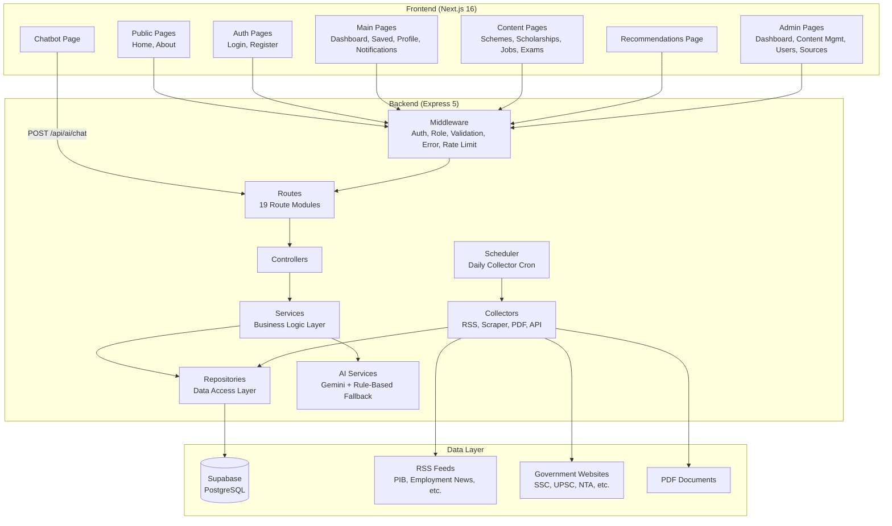
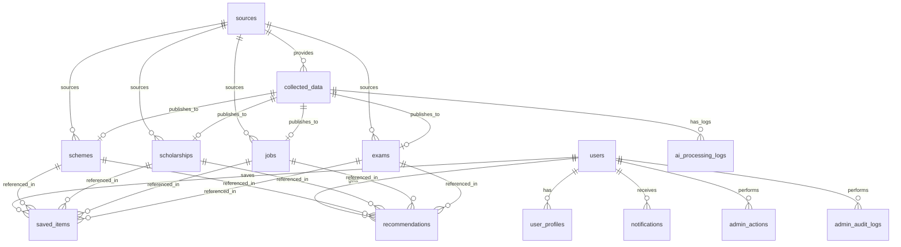
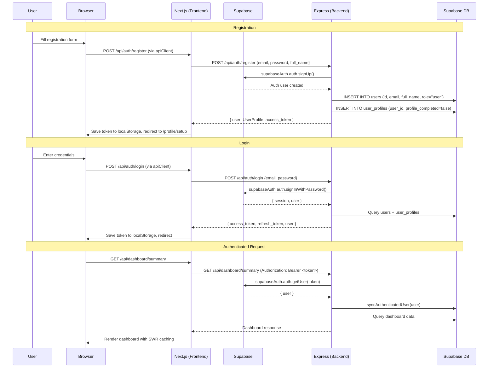
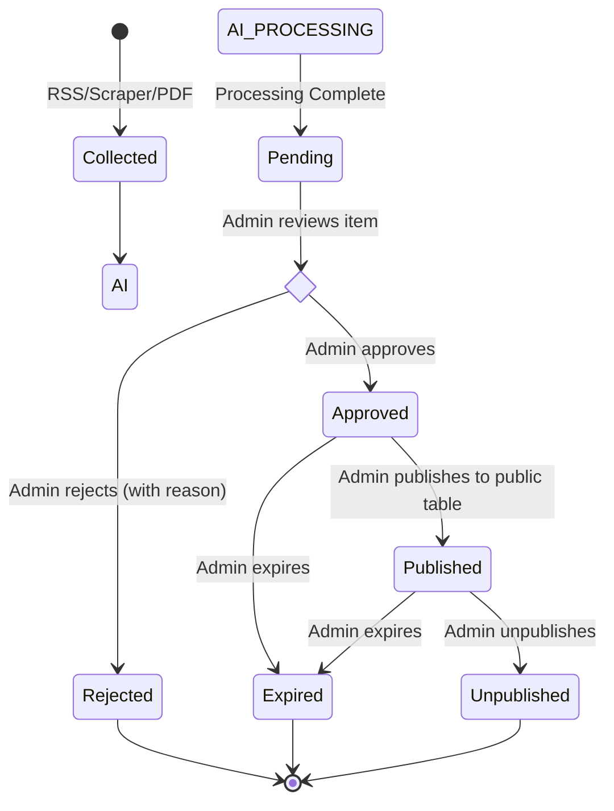
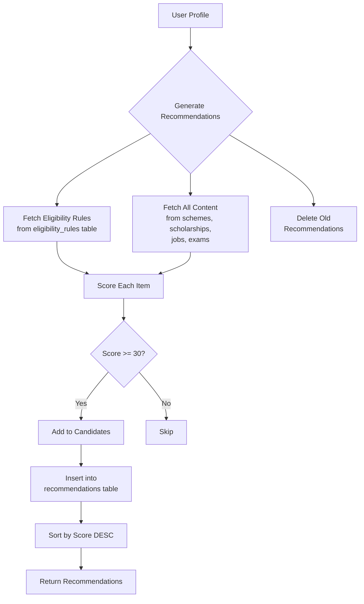
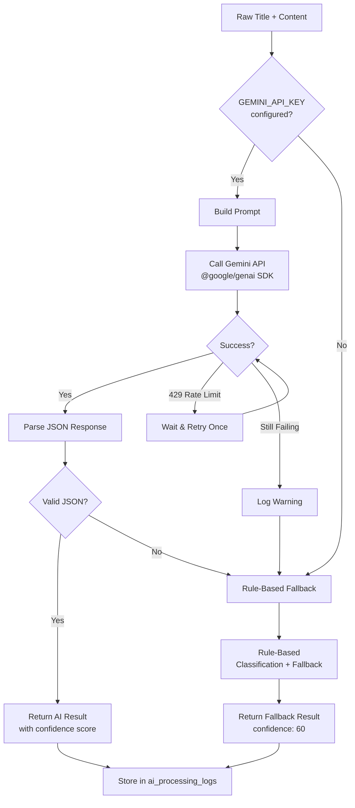

# BharatLens — Complete Codebase Documentation

> **Version:** 1.3.0  
> **Stack:** Next.js 16 (Frontend) + Express 5 (Backend) + Supabase (Database/Auth)  
> **Last Updated:** June 2026
>
> **Status:** Frontend builds clean (TypeScript). Backend type-checks clean. AI services upgraded with Gemini integration. Chatbot backend implemented. Testing coverage remains minimal (1 backend test file). See [Testing Status](#17-testing-status) and [Known Issues](#18-known-issues--technical-debt).

---

## Table of Contents

1. [Project Overview](#1-project-overview)
2. [System Architecture](#2-system-architecture)
3. [Folder Structure](#3-folder-structure)
4. [Frontend Documentation](#4-frontend-documentation)
5. [Backend Documentation](#5-backend-documentation)
6. [API Documentation](#6-api-documentation)
7. [Database Schema](#7-database-schema)
8. [Authentication Flow](#8-authentication-flow)
9. [Admin Workflow](#9-admin-workflow)
10. [Recommendation Engine](#10-recommendation-engine)
11. [Data Collection Workflow](#11-data-collection-workflow)
12. [AI Services & Gemini Integration](#12-ai-services--gemini-integration)
13. [Loading & Caching Strategy](#13-loading--caching-strategy)
14. [Deployment Guide](#14-deployment-guide)
15. [Security Analysis](#15-security-analysis)
16. [Performance Analysis](#16-performance-analysis)
17. [Testing Status](#17-testing-status)
18. [Known Issues & Technical Debt](#18-known-issues--technical-debt)
19. [Final Audit Summary](#19-final-audit-summary)
20. [Future Roadmap](#20-future-roadmap)

---

## 1. Project Overview

BharatLens is an AI-powered discovery platform that provides verified information about Indian government schemes, scholarships, jobs, and exams. It aggregates data from multiple official government sources (RSS feeds, scraping, PDFs), classifies and cleans the data using a hybrid AI pipeline (Gemini + rule-based fallback), and surfaces personalized recommendations through a rule-based eligibility matching engine.

### Core Value Proposition

- **Centralized Discovery:** Aggregates schemes, scholarships, jobs, and exams from PIB, Employment News, MyGov, India.gov, SSC, UPSC, NTA, AICTE, UGC, RRB, and Data.gov
- **AI-Powered Classification:** Uses Google Gemini API for intelligent content classification and data extraction, with automatic fallback to rule-based methods
- **Rule-Based Personalization:** Profile-based recommendation engine that matches users to relevant opportunities using static scoring rules
- **Verified Content Pipeline:** Admin moderation workflow with AI processing → verification → approval → publishing stages
- **AI Chatbot:** Gemini-powered conversational assistant for user queries
- **Multi-platform Access:** Responsive web interface with both user-facing and admin-facing panels

### Key Technologies

| Layer | Technology | Version |
|---|---|---|
| **Frontend Framework** | Next.js | 16.2.6 |
| **UI Library** | React | 19.2.4 |
| **Styling** | Tailwind CSS | v4 |
| **Animations** | Framer Motion | 12.40.0 |
| **Icons** | Lucide React | 1.16.0 |
| **Client Cache** | SWR | 2.4.1 |
| **Backend Framework** | Express | 5.2.1 |
| **Database** | Supabase (PostgreSQL) | — |
| **Auth** | Supabase Auth | — |
| **Validation** | Zod | 4.4.3 |
| **AI SDK** | @google/genai | 2.8.0 |
| **RSS Parsing** | rss-parser | 3.13.0 |
| **Web Scraping** | Cheerio + Axios | 1.2.0 / 1.17.0 |
| **PDF Parsing** | pdf-parse | 2.4.5 |
| **Task Scheduling** | node-cron | 4.2.1 |
| **Security** | Helmet | 8.2.0 |

---

## 2. System Architecture



### Architecture Principles

1. **Layered Backend:** Routes → Controllers → Services → Repositories → Supabase
2. **Rate Limited:** Four tiers — 100 req/min general API, 10 req/min auth, 5 req/min chatbot, 30-300 req/min admin (dev/production)
3. **Security Headers:** Strict CSP, frame-src denied, CORS restricted, request size limited to 1MB
4. **Production-Safe Errors:** 500 errors return generic messages in production; full details logged server-side
5. **Client-side Rendering:** All authenticated pages use `"use client"` for interactivity
6. **Token-based Auth:** JWT tokens managed through Supabase Auth with bearer tokens
7. **Admin Isolation:** Separate layout and sidebar with role-based access
8. **Data Pipeline:** External sources → Collectors → `collected_data` table → AI Processing → Verification → Public tables
9. **Client-Side Caching:** SWR with stale-while-revalidate for all GET API requests; `keepPreviousData: true` globally; `revalidateOnFocus: false`
10. **Tab-Switch Resilience:** AuthProvider ignores `TOKEN_REFRESHED` events; main layout skeleton only on very first render; admin pages use `hasLoadedOnce` ref

---

## 3. Folder Structure

```
BharatLens/
├── frontend/                          # Next.js 16 Frontend
│   ├── app/                          # App Router Pages
│   │   ├── layout.tsx                # Root layout w/ AuthProvider & AppShell
│   │   ├── page.tsx                  # Landing page
│   │   ├── globals.css               # Tailwind + custom CSS
│   │   ├── about/page.tsx            # About page
│   │   ├── (main)/layout.tsx         # Authenticated layout w/ skeleton loading
│   │   ├── (main)/dashboard/page.tsx # User dashboard
│   │   ├── (main)/dashboard/profile/  # Dashboard profile sub-page
│   │   ├── (main)/saved/page.tsx     # Saved items
│   │   ├── (main)/profile/page.tsx   # User profile
│   │   ├── (main)/profile/setup/     # Profile setup wizard
│   │   ├── (main)/settings/page.tsx  # Settings (Coming Soon placeholder)
│   │   ├── (main)/notifications/page.tsx
│   │   ├── (main)/recommendations/page.tsx
│   │   ├── (main)/chatbot/page.tsx   # AI chatbot/assistant page
│   │   ├── (main)/schemes/page.tsx   # Schemes listing
│   │   ├── (main)/schemes/[id]/page.tsx # Scheme detail
│   │   ├── (main)/scholarships/page.tsx
│   │   ├── (main)/scholarships/[id]/page.tsx
│   │   ├── (main)/jobs/page.tsx
│   │   ├── (main)/jobs/[id]/page.tsx
│   │   ├── (main)/exams/page.tsx
│   │   ├── (main)/exams/[id]/page.tsx
│   │   ├── admin/layout.tsx          # Admin layout w/ sidebar + role check
│   │   ├── admin/page.tsx            # Admin dashboard
│   │   ├── admin/verification/        # Content verification (pending items)
│   │   ├── admin/approved/            # Approved items
│   │   ├── admin/published/           # Published items
│   │   ├── admin/rejected/            # Rejected items
│   │   ├── admin/sources/             # Data source management
│   │   ├── admin/users/               # User management
│   │   ├── admin/updates/             # Content updates management
│   │   └── auth/callback/route.ts    # OAuth callback handler
│   ├── components/                   # React Components
│   │   ├── auth/                     # AuthProvider, OriginGuard
│   │   ├── layout/                   # AppShell, SiteHeader, SiteFooter, MobileNav
│   │   ├── admin/                    # AdminSidebar, AdminHeader, AdminStatCard,
│   │   │                             # AdminItemTable, AdminTable, VerificationTable,
│   │   │                             # ModerationTable, BulkActionBar, SlidePanel,
│   │   │                             # StatusBadge, SourceBadge, ConfidenceBadge,
│   │   │                             # FilterBar, StatCard, VerificationDetailPanel
│   │   ├── cards/                    # BharatLensCard, SavedItemCard, NotificationCard
│   │   ├── details/                  # BharatLensDetail, DetailHero, DetailSidebar,
│   │   │                             # DetailLoading, DetailError, EligibilityList,
│   │   │                             # InfoSection, TimelineSection, DocumentsList,
│   │   │                             # RelatedCards
│   │   ├── forms/                    # LoginForm, RegisterForm, ForgotPasswordForm,
│   │   │                             # ResetPasswordForm
│   │   ├── filters/                  # ListingSearchFilter
│   │   └── ui/                      # skeleton, Spinner, button, card, badge, separator
│   │       └── skeletons/           # DashboardSkeleton, CardSkeleton, ListSkeleton, PageSkeleton
│   ├── hooks/                        # Custom hooks
│   │   ├── useAuth.ts                # Auth context wrapper
│   │   ├── useApi.ts                 # SWR-based API hooks (useSchemes, useJobs, etc.)
│   │   ├── useProfile.ts             # Deleted — was unused
│   │   └── useSavedItems.ts          # Deleted — was unused
│   ├── lib/                          # API & utilities
│   │   ├── api/                      # API clients (client, auth-api, content-api,
│   │   │                             # admin, dashboard-api, admin-utils)
│   │   ├── supabase/                 # Supabase client (client.ts, server.ts)
│   │   └── types/                    # Shared type definitions
│   ├── types/                        # TypeScript type definitions
│   ├── utils/                        # Utility functions
│   │   ├── cn.ts                     # Tailwind class merging
│   │   ├── formatDate.ts             # Date formatting
│   │   ├── filterItems.ts            # Client-side item filtering
│   │   └── getCategoryCounts.ts      # Tab counter utility w/ normalizeSubType
│   ├── proxy.ts                      # Next.js middleware for auth protection
│   ├── next.config.ts                # Next.js config
│   └── package.json                  # Frontend dependencies
│
├── backend/                          # Express 5 Backend
│   ├── src/
│   │   ├── server.ts                 # Server entry point
│   │   ├── app.ts                    # Express app configuration (19 route modules)
│   │   ├── config/                   # Configuration files
│   │   │   ├── env.ts                # Zod-validated environment variables (includes Gemini)
│   │   │   ├── supabase.ts           # Supabase client setup
│   │   │   └── collector.config.ts   # Collector source definitions (RSS, scraper, PDF)
│   │   ├── routes/                   # Express routers (19 modules)
│   │   ├── controllers/             # Request handlers
│   │   ├── services/                 # Business logic
│   │   ├── repositories/            # Data access layer
│   │   ├── middlewares/              # Express middleware (7 modules)
│   │   ├── validators/              # Zod validation schemas
│   │   ├── collectors/              # Data collectors
│   │   │   ├── rss/                  # RSS feed collectors (PIB, Employment, MyGov, India.gov)
│   │   │   ├── scraping/             # Website scrapers (SSC, UPSC, NTA, AICTE, UGC, RRB)
│   │   │   ├── pdf/                  # PDF extractors
│   │   │   └── apis/                 # External API collectors (Data.gov placeholder, MyGov)
│   │   ├── ai/                       # AI services
│   │   │   ├── gemini.service.ts     # Gemini AI classification & extraction
│   │   │   ├── classifier.service.ts # Rule-based text classifier (fallback)
│   │   │   ├── data-cleaner.service.ts # Text cleaning, URL validation, date parsing
│   │   │   └── duplicate-detector.service.ts # URL, hash, title, and fuzzy dedup
│   │   ├── jobs/                     # Scheduled jobs (daily collector at 2 AM)
│   │   ├── types/                    # TypeScript types
│   │   ├── utils/                    # Utilities (pagination, async-handler, app-error, etc.)
│   │   ├── constants/               # Status constants (VERIFICATION_STATUSES, CONTENT_ACTIONS)
│   │   └── docs/                     # OpenAPI spec
│   ├── migrations/                   # SQL migration scripts (12 files: 000-011)
│   ├── scripts/                      # Utility scripts (run-migration.ts)
│   ├── tests/                        # Backend tests
│   │   └── controllers/              # Controller tests (1 test file)
│   ├── PAGINATION_ARCHITECTURE.md    # Pagination design doc
│   ├── jest.config.cjs
│   └── package.json
│
├── DOCUMENTATION.md                  # This file
├── AGENTS.md                         # AI agent configuration
├── CLAUDE.md                         # AI assistant rules
├── PROJECT_WORKFLOW.md               # Development workflow guide
├── PIPELINE_DOCUMENTATION.md          # Data pipeline documentation
├── README.md
└── .gitignore
```

---

## 4. Frontend Documentation

### 4.1 Pages & Routing

The application uses Next.js App Router with the following route groups:

| Route Group | Path | Purpose | Auth Required | Layout |
|---|---|---|---|---|
| **Public** | `/` | Landing page | No | AppShell |
| | `/about` | About page | No | AppShell |
| **Main** | `/dashboard` | User dashboard | Yes + profile check | MainLayout |
| | `/dashboard/profile` | Dashboard profile sub-page | Yes | MainLayout |
| | `/profile` | View/edit profile | Yes | MainLayout |
| | `/profile/setup` | Profile setup wizard (for new users) | Yes | MainLayout |
| | `/saved` | Saved items | Yes | MainLayout |
| | `/notifications` | Notifications list | Yes | MainLayout |
| | `/recommendations` | AI recommendations | Yes | MainLayout |
| | `/chatbot` | AI chatbot/assistant | Yes | MainLayout |
| | `/settings` | Account settings (Coming Soon) | Yes | MainLayout |
| | `/schemes` | Schemes listing | Yes | MainLayout |
| | `/schemes/[id]` | Scheme detail | Yes | MainLayout |
| | `/scholarships` | Scholarship listing | Yes | MainLayout |
| | `/scholarships/[id]` | Scholarship detail | Yes | MainLayout |
| | `/jobs` | Jobs listing | Yes | MainLayout |
| | `/jobs/[id]` | Job detail | Yes | MainLayout |
| | `/exams` | Exams listing | Yes | MainLayout |
| | `/exams/[id]` | Exam detail | Yes | MainLayout |
| **Admin** | `/admin` | Admin dashboard | Yes + admin/moderator role | AdminLayout |
| | `/admin/verification` | Data verification (pending items) | Yes + admin/moderator role | AdminLayout |
| | `/admin/approved` | Approved items | Yes + admin/moderator role | AdminLayout |
| | `/admin/published` | Published items | Yes + admin/moderator role | AdminLayout |
| | `/admin/rejected` | Rejected items | Yes + admin/moderator role | AdminLayout |
| | `/admin/sources` | Data sources management | Yes + admin/moderator role | AdminLayout |
| | `/admin/users` | User management | Yes + admin/moderator role | AdminLayout |
| | `/admin/updates` | Content updates | Yes + admin/moderator role | AdminLayout |
| **Callback** | `/auth/callback` | OAuth callback | Public | None |

> **Note:** Auth pages (login, register, forgot-password, reset-password) are likely SPA-rendered via form components within the AppShell layout, not separate route files. The `(auth)` route group directory was removed.

### 4.2 Layout Architecture

```
RootLayout (app/layout.tsx)
├── AuthProvider
│   ├── OriginGuard
│   └── AppShell (components/layout/AppShell.tsx)
│       ├── SiteHeader (hidden on /admin)
│       ├── Main Content (flex-1)
│       │   ├── (main)/layout.tsx     ← Auth check + profile check
│       │   │   └── Page content (SWR-served with skeletons)
│       │   ├── (/)
│       │   │   └── Landing / About pages
│       │   └── admin/layout.tsx      ← Role check + sidebar + header
│       │       └── Admin content
│       └── SiteFooter (hidden on /admin)
```

### 4.3 Key Components

#### Layout Components
- **`AppShell.tsx`** — Conditionally renders header/footer based on route (hidden for admin)
- **`SiteHeader.tsx`** — Sticky navigation with scroll effect, explore dropdown, profile dropdown, mobile menu
- **`SiteFooter.tsx`** — Footer with brand, explore links, resource links
- **`MobileNav.tsx`** — Mobile navigation drawer

#### Auth Components
- **`AuthProvider.tsx`** — React context for Supabase session management. Handles token save/clear, sign out, session refresh. **Ignores `TOKEN_REFRESHED` events** to prevent unnecessary re-renders on background token refresh.
- **`OriginGuard.tsx`** — Redirects users from `0.0.0.0` to `localhost` to fix OAuth PKCE state issues

#### Admin Components
- **`AdminSidebar.tsx`** — Admin navigation sidebar with route links
- **`AdminHeader.tsx`** — Admin top header with mobile menu toggle
- **`AdminStatCard.tsx`** — Statistics display card
- **`AdminItemTable.tsx`** — Table for admin item listings with actions
- **`AdminTable.tsx`** — Generic admin table component
- **`VerificationTable.tsx`** — Verification items table for pending items
- **`ModerationTable.tsx`** — Moderation table with approve/reject actions
- **`BulkActionBar.tsx`** — Bulk approve/reject/publish/delete bar with per-action spinners
- **`VerificationDetailPanel.tsx`** — Detail panel for approve/reject/publish workflow
- **`SlidePanel.tsx`** — Slide-out detail panel for item inspection
- **`StatusBadge.tsx`** — Colored badge for verification/processing status
- **`SourceBadge.tsx`** — Data source badge
- **`ConfidenceBadge.tsx`** — AI confidence score badge
- **`FilterBar.tsx`** — Filter bar for admin listings
- **`StatCard.tsx`** — Generic stat card component

#### Card Components
- **`BharatLensCard.tsx`** — Unified card component used for all content types (schemes, scholarships, jobs, exams). Supports CTA with direct external URL (opens in new tab) or detail page fallback. Save button with stopPropagation.
- **`SavedItemCard.tsx`** — Card for saved items with remove capability
- **`NotificationCard.tsx`** — Notification display card

#### Detail Components
- **`BharatLensDetail.tsx`** — Unified detail page for all content types (replaces individual detail components)
- **`DetailHero.tsx`** — Hero section for detail pages
- **`DetailSidebar.tsx`** — Sidebar with actions (save, share, apply)
- **`DetailLoading.tsx`** — Skeleton loading state for detail pages
- **`DetailError.tsx`** — Error state for detail pages
- **`DetailPage.tsx`** — Legacy generic detail page wrapper (mostly unused)
- **`EligibilityList.tsx`** — Eligibility criteria display
- **`InfoSection.tsx`** — Information sections
- **`DocumentsList.tsx`** — Required documents display
- **`TimelineSection.tsx`** — Timeline view for dates
- **`RelatedCards.tsx`** — Related opportunities

#### Form Components
- **`LoginForm.tsx`** — Email/password and Google OAuth login
- **`RegisterForm.tsx`** — User registration form
- **`ForgotPasswordForm.tsx`** — Password reset request
- **`ResetPasswordForm.tsx`** — Password reset with new password

#### Filter Components
- **`ListingSearchFilter.tsx`** — Search input + category filter + result count

#### UI Components
- **Skeletons:** `DashboardSkeleton`, `CardSkeleton`, `ListSkeleton`, `PageSkeleton`
- **`Spinner.tsx`** — Animation-only spinner (used for actions: save, delete, form submit)
- **`Skeleton.tsx`** — Base skeleton component
- **`button.tsx`**, **`card.tsx`**, **`badge.tsx`**, **`separator.tsx`** — Basic UI primitives

### 4.4 Hooks

| Hook | File | Status | Purpose |
|---|---|---|---|
| `useAuth` | `frontend/hooks/useAuth.ts` | **Active** | Wraps AuthContext for authentication state |
| `useSchemes` | `frontend/hooks/useApi.ts` | **Active** | SWR-based scheme listing with caching |
| `useJobs` | `frontend/hooks/useApi.ts` | **Active** | SWR-based job listing with caching |
| `useExams` | `frontend/hooks/useApi.ts` | **Active** | SWR-based exam listing with caching |
| `useScholarships` | `frontend/hooks/useApi.ts` | **Active** | SWR-based scholarship listing with caching |
| `useSavedItems` | `frontend/hooks/useApi.ts` | **Active** | SWR-based saved items with caching |
| `useNotifications` | `frontend/hooks/useApi.ts` | **Active** | SWR-based notifications with caching |
| `useRecommendations` | `frontend/hooks/useApi.ts` | **Active** | SWR-based recommendations with caching |
| `useDashboardSummary` | `frontend/hooks/useApi.ts` | **Active** | SWR-based dashboard data with `keepPreviousData` |
| `useCurrentUser` | `frontend/hooks/useApi.ts` | **Active** | SWR-based current user profile with caching |
| `useAdminStats` | `frontend/hooks/useApi.ts` | **Active** | SWR-based admin stats with caching |
| `useAdminCollectedData` | `frontend/hooks/useApi.ts` | **Active** | SWR-based admin collected data with caching |
| `useSavedItemsMap` | `frontend/hooks/useApi.ts` | **Active** | SWR-based saved items map (item_id → boolean) |
| `useProfile` | ❌ removed | Was unused Generic useState wrapper, never imported |
| `useSavedItems` (legacy) | ❌ Removed | Dead/unused hook — use `useSavedItems` from `useApi.ts` instead |

### 4.5 API Client Architecture

The frontend uses a centralized API client (`frontend/lib/api/client.ts`) that:

1. Automatically retrieves auth tokens from Supabase session or localStorage fallback
2. Handles standardized response format `{ success, message, data, pagination }`
3. Manages 401 errors with session verification and redirect to login
4. Supports "optional" mode (returns `undefined` instead of throwing on failure)
5. Supports "rawResponse" mode for accessing full response object including pagination
6. Has **request deduplication**: Concurrent identical GET calls share a single in-flight promise

### 4.6 Styling

- **Tailwind CSS v4** with custom CSS variables in `globals.css`
- Custom color palette: `--bl-navy: #1a3c6e`, `--bl-accent: #3b82f6`, `--bl-sand: #f5f3ee`
- Consistent design language: rounded cards, shadows, hover transitions, backdrop blur
- Responsive design with mobile-first breakpoints
- Custom scrollbar styling
- Animations via CSS transitions and keyframes

### 4.7 Tab Counter & Content Action System

Tab counters on listing pages (Jobs, Exams) use the `getCategoryCounts` utility:

- **`frontend/utils/getCategoryCounts.ts`** — Computes tab counts from full unfiltered items array. Never recalculates from filtered data.
- **`normalizeSubType()`** — Normalizes database sub_category values to canonical form:
  - `apply` / `Apply` / `apply_now` / `Apply Now` → `apply_now`
  - `admit_card` / `Admit Card` → `admit_card`
  - `result` / `Result` → `result`
  - `answer_key` / `Answer Key` → `answer_key`
  - `notification` / `Notify` / `Notifications` → `notification`
- Tab filtering is done **client-side** (tab param no longer sent to API). Tab counts are always computed from the full `result?.items` array.
- CTA buttons on cards detect external URLs first (opens in new tab). Falls back to internal detail page if no URL.

---

## 5. Backend Documentation

### 5.1 Application Entry Point

**`backend/src/server.ts`** — Starts Express server on configured PORT (default 5001).

**`backend/src/app.ts`** — Configures:
- Security middleware (Helmet with strict CSP)
- CORS (FRONTEND_URL + localhost:3001)
- JSON body parsing (1MB limit)
- Logging (Morgan)
- Rate limiting (4 tiers: api/auth/chat/admin)
- 22 route modules mounted under `/api`
- Health check endpoints (`/` and `/api/health`)
- Daily collector cron job initialization (if `ENABLE_COLLECTOR_CRON=true`)
- 404 handler + global error handler

### 5.2 Middleware Stack

| Middleware | File | Purpose |
|---|---|---|
| `requireAuth` | `backend/src/middlewares/auth.middleware.ts` | Extracts Bearer token, verifies with Supabase, syncs user record |
| `requireRole` | `backend/src/middlewares/role.middleware.ts` | Role-based access (`admin`, `moderator`) |
| `validate` | `backend/src/middlewares/validate.middleware.ts` | Zod schema validation for params/body/query |
| `injectItemType` | `backend/src/middlewares/inject-item-type.middleware.ts` | Converts plural URL paths to singular item types |
| `apiLimiter` | `backend/src/middlewares/rate-limit.middleware.ts` | 100 req/min general API |
| `authLimiter` | `backend/src/middlewares/rate-limit.middleware.ts` | 10 req/min auth endpoints |
| `chatLimiter` | `backend/src/middlewares/rate-limit.middleware.ts` | 5 req/min chatbot (protects Gemini quota) |
| `adminLimiter` | `backend/src/middlewares/rate-limit.middleware.ts` | 300 req/min dev, 100 req/min prod |
| `errorHandler` | `backend/src/middlewares/error.middleware.ts` | Global error handler for AppError, ZodError, generic errors |
| `notFoundHandler` | `backend/src/middlewares/not-found.middleware.ts` | 404 handler for unknown routes |

### 5.3 Route Modules (22)

All routes are mounted under `/api` in `app.ts`:

| Route Prefix | File | Auth Required | Key Endpoints |
|---|---|---|---|
| `/api/auth` | `auth.routes.ts` | Partial | Register, Login, Logout, Me, Update Profile, Get by ID |
| `/api/schemes` | `scheme.routes.ts` | No | List (paginated/filtered/sorted), Get by ID |
| `/api/scholarships` | `scholarship.routes.ts` | No | List, Get by ID |
| `/api/jobs` | `job.routes.ts` | No | List, Get by ID |
| `/api/exams` | `exam.routes.ts` | No | List, Get by ID |
| `/api/search` | `search.routes.ts` | No | Search across all content types |
| `/api/eligibility` | `eligibility.routes.ts` | No | Check eligibility |
| `/api/recommendations` | `recommendation.routes.ts` | Yes | List, Generate, By Type, Mark Viewed |
| `/api/profile` | `profile.routes.ts` | Yes | Get own, Update, Create |
| `/api/notifications` | `notifications.routes.ts` | Yes | List, Unread count, Mark read, Delete |
| `/api/saved` | `saved.routes.ts` | Yes | List, Save, Remove, Check |
| `/api/dashboard` | `dashboard.routes.ts` | Yes | Dashboard summary |
| `/api/admin` | `admin.routes.ts` | Yes + Admin/Mod | Stats, Users, Sources, Items CRUD, Collected data workflow |
| `/api/collectors` | `collector.routes.ts` | **No** ⚠️ | Status, Stats, Run collectors (unauthenticated) |
| `/api/pdf` | `pdf.routes.ts` | Yes + Admin/Mod | Extract PDF text |
| `/api/ai-processing` | `ai-processing.routes.ts` | Yes + Admin/Mod | Process single item, process pending batch, get logs |
| `/api/ai` | `chat.routes.ts` | Yes + chatLimiter | POST `/chat` — AI chatbot with Gemini |
| `/api/pipeline` | `pipeline.routes.ts` | Yes + Admin/Mod | Process collected data |
| `/api/updates` | `content-updates.routes.ts` | Partial | List (public), Create/Update (admin) |
| `/api/docs` | `docs.routes.ts` | No | OpenAPI spec |
| `/api/verification` | (inlined in app.ts) | Yes + Admin/Mod | POST `/recheck/:id` — Recheck verification |
| `/api/test-db` | `test.route.ts` | No (dev only) | Database connectivity test |

### 5.4 Route Mounting Order in app.ts

```typescript
app.use("/api/docs", docsRoutes);
app.use("/api/auth", authRoutes);
app.use("/api/search", searchRoutes);
app.use("/api/eligibility", eligibilityRoutes);
app.use("/api/recommendations", recommendationRoutes);
app.use("/api/profile", profileRoutes);
app.use("/api/notifications", notificationsRoutes);
app.use("/api/saved", savedRoutes);
app.use("/api/collectors", collectorRoutes);
app.use("/api/pdf", pdfRoutes);
app.use("/api/test-db", testRoutes); // development only
app.use("/api/dashboard", dashboardRoutes);
app.use("/api/schemes", schemeRoutes);
app.use("/api/scholarships", scholarshipRoutes);
app.use("/api/jobs", jobRoutes);
app.use("/api/exams", examRoutes);
app.use("/api/ai-processing", aiProcessingRoutes);
app.use("/api/ai", chatRoutes);
app.use("/api/updates", contentUpdatesRoutes);
app.use("/api/pipeline", pipelineRoutes);
app.use("/api/verification", verificationRouter); // POST /recheck/:id only
app.use("/api/admin", adminRoutes);
```

### 5.5 Controller Layer

Each controller delegates to a service and handles request/response formatting. Key patterns:
- Uses `asyncHandler` wrapper to catch async errors
- Uses `sendSuccess` / `sendError` helpers for consistent responses
- Validated inputs accessed via `req.validatedBody`, `req.validatedParams`, `req.validatedQuery`
- Authenticated user accessed via `req.user`

### 5.6 Service Layer

Services contain business logic and orchestrate repository calls. All services in `backend/src/services/`:

| Service | Key Functions |
|---|---|
| `auth.service.ts` | registerNewUser, loginUser, fetchUserProfile, logoutUser, updateUserProfile |
| `scheme.service.ts` | fetchAllSchemes, fetchSchemeById |
| `scholarship.service.ts` | fetchAllScholarships, fetchScholarshipById |
| `job.service.ts` | fetchAllJobs, fetchJobById |
| `exam.service.ts` | fetchAllExams, fetchExamById |
| `search.service.ts` | performSearch (loads all content, filters by query, paginates) |
| `eligibility.service.ts` | determineEligibility (rule-based scoring) |
| `recommendation.service.ts` | getRecommendations, generateRecommendations, viewRecommendation |
| `profile.service.ts` | fetchProfile, modifyProfile |
| `dashboard.service.ts` | getDashboardSummary (aggregated via Promise.allSettled) |
| `notifications.service.ts` | fetchUserNotifications, readNotification, markReadAll, deleteNotification |
| `saved-items.service.ts` | fetchSavedItems, saveItem, deleteSavedItem, checkSavedItem |
| `admin.service.ts` | Extensive CRUD for content items, collected data workflow with fallback column detection |
| `collector.service.ts` | RSS/Scraper/PDF collection orchestration, stats, text processing |
| `chat.service.ts` | processChatMessage — Gemini-powered chatbot with profile context |
| `ai-processing.service.ts` | processSingleItem, processPendingItems, recheckVerification, getProcessingLogs |
| `pipeline.service.ts` | processCollectedData — batch AI processing pipeline |
| `verification.service.ts` | Verification recheck and duplicate detection |
| `scholarship.service.ts` | Scholarship-specific business logic |

### 5.7 Repository Layer

Repositories interact directly with Supabase. All repositories in `backend/src/repositories/`:

| Repository | Key Functions | Table(s) |
|---|---|---|
| `auth.repository.ts` | registerUser, authenticateUser, findUserById, signOutUser, updateUserProfile, syncAuthenticatedUser | `users`, `user_profiles` |
| `scheme.repository.ts` | getAllSchemes (paginated/filtered/sorted/search), getSchemeById | `schemes` |
| `scholarship.repository.ts` | getAllScholarships, getScholarshipById | `scholarships` |
| `job.repository.ts` | getAllJobs, getJobById | `jobs` |
| `exam.repository.ts` | getAllExams, getExamById | `exams` |
| `admin.repository.ts` | CRUD for admin items, stats, users, sources, admin actions | All content tables, `users`, `sources`, `admin_actions` |
| `search.repository.ts` | searchAll (loads all content, maps to unified format) | All content tables |
| `eligibility.repository.ts` | evaluateEligibility (rule-based) | In-memory |
| `recommendation.repository.ts` | fetchRecommendations, generateRecommendationsForUser, markRecommendationViewed | `recommendations`, `eligibility_rules`, all content tables |
| `collected-data.repository.ts` | CRUD for collected data, dedup check, bulk insert, source management | `collected_data`, `sources` |
| `saved-items.repository.ts` | listSavedItems, addSavedItem, removeSavedItem, findSavedItem | `saved_items` |
| `notifications.repository.ts` | getNotificationsForUser, markNotificationAsRead, markAllNotificationsRead, deleteNotification, countUnreadNotifications | `notifications` |
| `audit.repository.ts` | insertAdminAuditLog | `admin_audit_logs` |
| `exam.repository.ts` | getExamsByCategory, getExamsByDateRange | `exams` |
| `job.repository.ts` | getJobsByCategory, getJobsByDateRange | `jobs` |
| `scheme.repository.ts` | getSchemesByCategory | `schemes` |
| `scholarship.repository.ts` | getScholarshipsByCategory | `scholarships` |
| `source.repository.ts` | getSourceById, getAllSources | `sources` |
| `content-updates.repository.ts` | getPublicUpdates, createUpdate, updateStatus | `content_updates` |
| `ai-processing-log.repository.ts` | getLogsForItem, createLog | `ai_processing_logs` |
| `notifications.repository.ts` | CRUD for notifications | `notifications` |

### 5.8 Validation Layer (Zod Schemas)

All validators in `backend/src/validators/`:

| Validator | Purpose |
|---|---|
| `query.validator.ts` | Pagination, sorting, filtering, search parameters |
| `auth.validator.ts` | Registration, login, profile update, user ID param |
| `admin.validator.ts` | Item params, review body, publish body, collected data edit, user role update |
| `common.validator.ts` | Generic ID param |
| `eligibility.validator.ts` | Eligibility check input |
| `notifications.validator.ts` | Notification ID, query params |
| `profile.validator.ts` | Profile creation and update with field normalization |
| `recommendation.validator.ts` | Recommendation queries, ID params |
| `saved-items.validator.ts` | Save item body, check params, user ID params |
| `search.validator.ts` | Search query params |
| `content-updates.validator.ts` | Public updates query, admin publish/update schemas |

### 5.9 Environment Configuration (`backend/src/config/env.ts`)

Uses Zod for validation. Fails fast on startup if required env vars missing.

| Variable | Required | Default | Notes |
|---|---|---|---|
| `NODE_ENV` | No | `development` | `development`, `production`, or `test` |
| `PORT` | No | `5001` | Server port |
| `FRONTEND_URL` | No | `http://localhost:3000` | CORS origin |
| `SUPABASE_URL` | **Yes** | — | Supabase project URL |
| `SUPABASE_ANON_KEY` | **Yes** | — | Anonymous public key |
| `SUPABASE_SERVICE_ROLE_KEY` | **Yes** | — | Service role key (admin operations) |
| `JWT_SECRET` | **Yes** (min 32 chars) | — | Used for JWT verification |
| `GEMINI_API_KEY` | No | — | Google Gemini API key (for AI classification & chatbot) |
| `GEMINI_MODEL` | No | `gemini-2.5-flash` | Gemini model name |
| `AI_BATCH_LIMIT` | No | `3` | Max items per AI batch (max 50) |
| `GEMINI_REQUEST_DELAY_MS` | No | `15000` | Delay between Gemini API calls (ms) |
| `DATA_GOV_API_KEY` | No | — | For Data.gov API collector |
| `ENABLE_COLLECTOR_CRON` | No | `false` | Enable daily collector cron job |

### 5.10 Content Status & Actions (`backend/src/constants/status.ts`)

```typescript
// Verification statuses for the pipeline
VERIFICATION_STATUSES = [
  "pending",      // Newly collected, awaiting AI processing
  "verified_ready", // AI processed, ready for admin review
  "approved",     // Admin approved
  "rejected",     // Admin rejected
  "published",    // Published to public table
  "duplicate",    // Detected as duplicate by AI
  "failed",       // AI processing failed
] as const;

// Content action types for job/exam items
CONTENT_ACTIONS = [
  "notification", // General notification/update
  "apply",        // Job/exam application open
  "admit_card",   // Admit card released
  "result",       // Results declared
  "answer_key",   // Answer key released
] as const;
```

---

## 6. API Documentation

### 6.1 Standard Response Format

```json
{
  "success": true,
  "message": "Schemes fetched successfully",
  "data": [...],
  "pagination": {
    "page": 1,
    "limit": 10,
    "total": 100,
    "totalPages": 10,
    "hasNextPage": true,
    "hasPreviousPage": false
  }
}
```

Error responses:
```json
{
  "success": false,
  "message": "Invalid authentication token",
  "error": "Expired authentication token"
}
```

### 6.2 Complete API Endpoint Reference

#### Authentication Endpoints

| Method | Path | Auth | Description |
|---|---|---|---|
| `POST` | `/api/auth/register` | No | Register new user |
| `POST` | `/api/auth/login` | No | Login with email/password |
| `POST` | `/api/auth/logout` | Yes | Logout current session |
| `GET` | `/api/auth/me` | Yes | Get current user profile |
| `PATCH` | `/api/auth/profile` | Yes | Update own profile |
| `GET` | `/api/auth/:id` | No | Get user profile by ID |

#### Content Endpoints (Public)

| Method | Path | Auth | Description |
|---|---|---|---|
| `GET` | `/api/schemes` | No | List schemes (paginated, filtered, sorted) |
| `GET` | `/api/schemes/:id` | No | Get scheme by ID |
| `GET` | `/api/scholarships` | No | List scholarships |
| `GET` | `/api/scholarships/:id` | No | Get scholarship by ID |
| `GET` | `/api/jobs` | No | List jobs |
| `GET` | `/api/jobs/:id` | No | Get job by ID |
| `GET` | `/api/exams` | No | List exams |
| `GET` | `/api/exams/:id` | No | Get exam by ID |

**Content List Query Parameters:** `page`, `limit` (max 100), `search`, `state`, `category`, `tab`, `sortBy` (`created_at` | `updated_at` | `deadline` | `title`), `sortOrder` (`asc` | `desc`)

#### Search & Eligibility

| Method | Path | Auth | Description |
|---|---|---|---|
| `GET` | `/api/search` | No | Search across all content types |
| `POST` | `/api/eligibility` | No | Check eligibility (rule-based) |

**Search Parameters:** `query`, `page`, `limit`

**Eligibility Body:**
```json
{
  "age": 25, "state": "Maharashtra", "income": 300000,
  "education": "Graduate", "occupation": "Student"
}
```

#### Recommendations (Auth Required)

| Method | Path | Description |
|---|---|---|
| `GET` | `/api/recommendations` | List recommendations (paginated) |
| `POST` | `/api/recommendations/generate` | Generate/regenerate recommendations |
| `GET` | `/api/recommendations/:itemType` | Get recommendations by type |
| `PATCH` | `/api/recommendations/:id/viewed` | Mark recommendation as viewed |

#### Profile (Auth Required)

| Method | Path | Description |
|---|---|---|
| `GET` | `/api/profile/me` | Get own profile |
| `GET` | `/api/profile` | Get own profile |
| `POST` | `/api/profile` | Create profile |
| `PUT` | `/api/profile` | Update profile |
| `PATCH` | `/api/profile` | Update profile |
| `GET` | `/api/profile/:id` | Get profile by ID |

> ⚠️ **Note:** Duplicate profile routes exist (`/api/profile` and `/api/auth/profile`). `/api/auth/profile` is the primary route used by the frontend auth API.

#### Notifications (Auth Required)

| Method | Path | Description |
|---|---|---|
| `GET` | `/api/notifications` | List notifications |
| `GET` | `/api/notifications/unread-count` | Get unread count |
| `PATCH` | `/api/notifications/:id/read` | Mark notification as read |
| `PATCH` | `/api/notifications/read-all` | Mark all as read |
| `DELETE` | `/api/notifications/:id` | Delete notification |

#### Saved Items (Auth Required)

| Method | Path | Description |
|---|---|---|
| `GET` | `/api/saved` | List saved items |
| `POST` | `/api/saved` | Save an item |
| `DELETE` | `/api/saved/:id` | Remove saved item by ID |
| `DELETE` | `/api/saved/item/:itemType/:itemId` | Remove saved item by item |
| `GET` | `/api/saved/:itemType/:itemId/check` | Check if item is saved |

#### Dashboard (Auth Required)

| Method | Path | Description |
|---|---|---|
| `GET` | `/api/dashboard/summary` | Aggregated dashboard data (profile, recommendations, notifications, saved count, recent updates) |

#### AI Processing (Auth Required + Admin/Moderator)

| Method | Path | Description |
|---|---|---|
| `POST` | `/api/ai-processing/process/:id` | Process a single collected_data item through AI pipeline |
| `POST` | `/api/ai-processing/process-pending` | Process all pending items in batch (query: `limit`) |
| `GET` | `/api/ai-processing/logs/:id` | Get processing logs for an item |
| `POST` | `/api/verification/recheck/:id` | Re-check verification on an already-processed item |

#### Chatbot (Auth Required)

| Method | Path | Rate Limit | Description |
|---|---|---|---|
| `POST` | `/api/ai/chat` | 5 req/min | Send a message to the AI chatbot. Body: `{ "message": "..." }` |

#### Pipeline (Auth Required + Admin/Moderator)

| Method | Path | Description |
|---|---|---|
| `POST` | `/api/pipeline/process-collected-data` | Trigger AI processing on pending collected data items |

#### Content Updates

| Method | Path | Auth | Description |
|---|---|---|---|
| `GET` | `/api/updates` | No | List public updates |
| `POST` | `/api/updates` | Yes + Admin/Mod | Create update |
| `PATCH` | `/api/updates/:id/status` | Yes + Admin/Mod | Update status |
| `GET` | `/api/updates/admin/all` | Yes + Admin/Mod | List all updates (admin) |

#### Admin Endpoints (Auth Required + Admin/Moderator Role)

| Method | Path | Description |
|---|---|---|
| `GET` | `/api/admin/stats` | Get admin statistics |
| `GET` | `/api/admin/users` | List all users |
| `PATCH` | `/api/admin/users/:userId/role` | Update user role |
| `GET` | `/api/admin/sources` | List data sources |
| `PATCH` | `/api/admin/sources/:id/verify` | Verify a source |
| `GET` | `/api/admin/updates` | List content updates |
| `GET` | `/api/admin/collected-data` | List collected data (paginated, filterable by status) |
| `GET` | `/api/admin/collected-data/:id` | Get collected data item |
| `PATCH` | `/api/admin/collected-data/:id/approve` | Approve collected data |
| `PATCH` | `/api/admin/collected-data/:id/reject` | Reject collected data |
| `PATCH` | `/api/admin/collected-data/:id/edit` | Edit collected data |
| `PATCH` | `/api/admin/collected-data/:id/publish` | Publish to public table |
| `PATCH` | `/api/admin/collected-data/:id/unpublish` | Unpublish from public table |
| `PATCH` | `/api/admin/collected-data/:id/delete` | Soft-delete collected data |
| `GET` | `/api/admin/pending` | Pending items (from collected_data) |
| `GET` | `/api/admin/approved` | Approved items |
| `GET` | `/api/admin/rejected` | Rejected items |
| `GET` | `/api/admin/published` | Published items |
| `GET` | `/api/admin/items/:status` | Items by status |
| `GET` | `/api/admin/items/:itemType/:itemId` | Get item by type and ID |
| `PATCH` | `/api/admin/items/:itemType/:itemId/approve` | Approve item |
| `PATCH` | `/api/admin/items/:itemType/:itemId/reject` | Reject item |
| `PATCH` | `/api/admin/items/:itemType/:itemId/publish` | Publish item |
| `PATCH` | `/api/admin/items/:itemType/:itemId/unpublish` | Unpublish item |
| `PATCH` | `/api/admin/items/:itemType/:itemId/expire` | Expire item |
| `PATCH` | `/api/admin/items/:itemType/:itemId` | Update item |
| `DELETE` | `/api/admin/items/:itemType/:itemId` | Delete item |

Plus redundant plural routes (`/schemes/:id`, `/scholarships/:id`, etc.) under `/api/admin` for backward compatibility.

#### Collector Endpoints (Auth Required — Admin/Moderator)

| Method | Path | Description |
|---|---|---|
| `GET` | `/api/collectors/status` | Collector status |
| `GET` | `/api/collectors/stats` | Collector statistics |
| `GET` | `/api/collectors/collected-data` | List collected data |
| `POST` | `/api/collectors/process` | Process raw data |
| `POST` | `/api/collectors/clean` | Clean text |
| `POST` | `/api/collectors/classify` | Classify text |
| `POST` | `/api/collectors/run-all` | Run all collectors |
| `POST` | `/api/collectors/rss` | Run all RSS collectors |
| `POST` | `/api/collectors/rss/pib` | Run PIB RSS collector |
| `POST` | `/api/collectors/rss/employment` | Run Employment News RSS |
| `POST` | `/api/collectors/rss/:sourceName` | Run RSS by source name |
| `POST` | `/api/collectors/scrape/:sourceName` | Run website scraper |
| `POST` | `/api/collectors/pdf` | Extract PDF |

---

## 7. Database Schema

### 7.1 Entity-Relationship Diagram



### 7.2 Migration Scripts

12 migration files exist in `backend/migrations/`:

| File | Description |
|---|---|
| `000_init_schema.sql` | Initial schema creation |
| `001_add_users_table.sql` | Users table |
| `002_add_posts_table.sql` | Posts table |
| `003_add_comments_table.sql` | Comments table |
| `004_add_tags_table.sql` | Tags table |
| `005_add_categories_table.sql` | Categories table |
| `006_update_user_roles.sql` | User role updates |
| `007_add_index_to_posts.sql` | Performance indexes |
| `008_fix_content_action_enum.sql` | Fixes `content_action_type` enum, adds verification/audit columns to all content tables |
| `009_alter_comments_table.sql` | Comments table alterations |
| `010_add_user_settings.sql` | User settings table |
| `011_add_auth_tokens.sql` | Auth tokens table |

### 7.3 Tables

#### `users`
| Column | Type | Notes |
|---|---|---|
| `id` | UUID (PK) | Matches Supabase Auth user ID |
| `email` | TEXT | |
| `full_name` | TEXT | |
| `role` | TEXT | `user` / `admin` / `moderator` |
| `age` | INTEGER | Optional |
| `annual_income` | NUMERIC | Optional |
| `preferred_language` | TEXT | Optional |
| `profile_completed` | BOOLEAN | Calculated from field completeness |
| `profile_completion_percentage` | INTEGER | 0-100 |
| `missing_profile_fields` | TEXT[] | Array of missing field names |
| `city` | TEXT | Optional |
| `state` | TEXT | Optional |
| `category` | TEXT | Optional (General/OBC/SC/ST) |
| `dob` | DATE | Optional |
| `education_level` | TEXT | Optional |
| `occupation` | TEXT | Optional |
| `user_type` | TEXT | Optional |
| `income_range` | TEXT | Optional |
| `gender` | TEXT | Optional |
| `created_at` | TIMESTAMPTZ | |
| `updated_at` | TIMESTAMPTZ | |

#### `user_profiles`
| Column | Type | Notes |
|---|---|---|
| `id` | UUID (PK) | Auto-generated |
| `user_id` | UUID (FK→users) | |
| `state` | TEXT | |
| `category` | TEXT | General/OBC/SC/ST |
| `dob` | DATE | |
| `education_level` | TEXT | |
| `occupation` | TEXT | |
| `user_type` | TEXT | |
| `income_range` | TEXT | |
| `gender` | TEXT | |
| `preferred_language` | TEXT | Default: `hinglish` |
| `profile_completed` | BOOLEAN | Calculated |
| `created_at` | TIMESTAMPTZ | |
| `updated_at` | TIMESTAMPTZ | |

#### `schemes`, `scholarships`, `jobs`, `exams`
Common columns (added via migration 008):

| Column | Type | Notes |
|---|---|---|
| `id` | UUID (PK) | |
| `title` | TEXT | |
| `description` | TEXT | |
| `category` | TEXT | |
| `state` | TEXT | |
| `provider` | TEXT | |
| `benefit` | TEXT | Schemes only |
| `eligibility` | TEXT | |
| `deadline` | DATE | |
| `status` | TEXT | `active` / `inactive` |
| `verification_status` | TEXT | `pending` / `approved` / `rejected` / `published` / `expired` |
| `official_url` | TEXT | |
| `apply_url` | TEXT | |
| `source_url` | TEXT | |
| `search_text` | TEXT | Full-text search index |
| `source_id` | UUID (FK→sources) | |
| `approved_by` | UUID (FK→users) | |
| `approved_at` | TIMESTAMPTZ | |
| `published_at` | TIMESTAMPTZ | |
| `is_expired` | BOOLEAN | |
| `expired_at` | TIMESTAMPTZ | |
| `created_at` | TIMESTAMPTZ | |
| `updated_at` | TIMESTAMPTZ | |

Content-type-specific columns:
- **scholarships:** `education_level`, `amount`, `rejection_reason`
- **jobs:** `department`, `qualification`, `vacancies`, `rejection_reason`
- **exams:** `exam_name`, `conducting_body`, `notification_date`, `application_start_date`, `application_end_date`, `admit_card_date`, `result_date`, `rejection_reason`

#### `collected_data`
Key columns: `id`, `source_id`, `raw_title`, `raw_content`, `raw_url`, `collection_method` (rss/scraper/pdf/api), `processing_status`, `verification_status` (pending/verified_ready/approved/rejected/published/duplicate/failed), `item_type`, `content_action`, `published_item_id`, `is_deleted`, `ai_classification`, `ai_confidence`, `ai_extracted_data`, `processing_logs`, audit fields (approved_by, rejected_by, published_by, etc.), timestamps.

#### `ai_processing_logs`
Key columns: `id`, `collected_data_id` (FK), `processing_step`, `status`, `details`, `confidence`, `created_at`.

#### `saved_items`
| Column | Type | Notes |
|---|---|---|
| `id` | UUID (PK) | |
| `user_id` | UUID (FK→users) | |
| `item_id` | UUID | References any content table |
| `item_type` | TEXT | `scheme` / `scholarship` / `job` / `exam` |
| `saved_at` | TIMESTAMPTZ | |
| `updated_at` | TIMESTAMPTZ | |

#### `notifications`
| Column | Type | Notes |
|---|---|---|
| `id` | UUID (PK) | |
| `user_id` | UUID (FK→users) | |
| `title` | TEXT | |
| `message` | TEXT | |
| `is_read` | BOOLEAN | |
| `created_at` | TIMESTAMPTZ | |
| `updated_at` | TIMESTAMPTZ | |

#### `recommendations`
| Column | Type | Notes |
|---|---|---|
| `id` | UUID (PK) | |
| `user_id` | UUID (FK→users) | |
| `item_id` | UUID | |
| `item_type` | TEXT | `scheme` / `scholarship` / `job` / `exam` |
| `reason` | TEXT | Human-readable match reason |
| `match_score` | NUMERIC | 0-100 |
| `is_viewed` | BOOLEAN | |
| `created_at` | TIMESTAMPTZ | |
| `updated_at` | TIMESTAMPTZ | |

#### `content_updates`
Key columns: `id`, `title`, `description`, `item_type`, `item_id`, `status`, `created_by`, `created_at`, `updated_at`.

#### `admin_actions`
| Column | Type | Notes |
|---|---|---|
| `id` | UUID (PK) | |
| `admin_id` | UUID (FK→users) | |
| `item_id` | UUID | |
| `item_type` | TEXT | |
| `action` | TEXT | `approve` / `reject` / `publish` / `unpublish` / `delete` |
| `detail` | TEXT | |
| `created_at` | TIMESTAMPTZ | |

#### `admin_audit_logs`
| Column | Type | Notes |
|---|---|---|
| `id` | UUID (PK) | |
| `admin_id` | TEXT | |
| `action` | TEXT | |
| `entity_type` | TEXT | |
| `entity_id` | TEXT | |
| `previous_status` | TEXT | |
| `new_status` | TEXT | |
| `changed_fields` | JSONB | |
| `reason` | TEXT | |
| `created_at` | TIMESTAMPTZ | |

#### `sources`
| Column | Type | Notes |
|---|---|---|
| `id` | UUID (PK) | |
| `source_name` | TEXT | PIB, Employment News, MyGov, India.gov, SSC, UPSC, NTA, AICTE, UGC, RRB |
| `source_url` | TEXT | |
| `source_type` | TEXT | `rss` / `website` / `api` / `pdf` |
| `is_verified` | BOOLEAN | |
| `trust_score` | NUMERIC | |
| `verified_by` | UUID (FK→users) | |
| `verified_at` | TIMESTAMPTZ | |
| `last_checked_at` | TIMESTAMPTZ | |

#### `eligibility_rules`
| Column | Type | Notes |
|---|---|---|
| `id` | UUID (PK) | |
| `item_id` | UUID | |
| `item_type` | TEXT | |
| `state` | TEXT | |
| `category` | TEXT | |
| `gender` | TEXT | |
| `education_level` | TEXT | |
| `occupation` | TEXT | |
| `user_type` | TEXT | |
| `income_range` | TEXT | |
| `min_age` | INTEGER | |
| `max_age` | INTEGER | |

---

## 8. Authentication Flow

### 8.1 Flow Diagram



### 8.2 Auth Implementation Details

1. **Frontend:** `AuthProvider.tsx` manages Supabase session via `onAuthStateChange` listener, with an 800ms timeout
2. **Token Storage:** JWT stored in localStorage under `bharatlens_auth_token` key
3. **Token Injection:** `apiClient.ts` retrieves token from Supabase session (primary) or localStorage (fallback)
4. **Backend Verification:** `auth.middleware.ts` calls `supabaseAuth.auth.getUser(token)` on every authenticated request
5. **User Sync:** After verifying token, `syncAuthenticatedUser()` ensures local `users` and `user_profiles` records exist
6. **Logout:** Calls Supabase signOut, clears localStorage, redirects to `/login?signed_out=1`
7. **OAuth Callback:** `frontend/app/auth/callback/route.ts` handles Google OAuth, exchanges code for session, checks profile completion, redirects accordingly
8. **Password Reset:** Handled via Supabase's built-in password reset flow

### 8.3 Auth Guard Layers

```
Layered Protection:
1. proxy.ts (Next.js Middleware) — First line of defense:
   - Protects routes matching protectedPrefixes
   - Redirects to /login if no session
   - Redirects auth pages to /dashboard if authenticated
   - Skips auth callback paths
   - Checks session cookie on initial page loads

2. (main)/layout.tsx (Client-side):
   - Shows skeleton only once on very first render
   - Once `initialLoadDone` → never shows skeleton again
   - Redirects to /login if no session
   - Fetches /api/auth/me for profile completion check
   - Redirects completed profiles away from /profile/setup

3. admin/layout.tsx (Client-side):
   - Shows admin layout skeleton while auth/role is loading
   - Checks for admin/moderator role
   - Redirects non-admin users to /
```

### 8.4 Tab-Switch Resilience

The auth system is designed to prevent skeleton flicker when users switch browser tabs:

1. **AuthProvider ignores `TOKEN_REFRESHED` events** — Supabase fires these ~hourly when auto-refreshing tokens. Previously, this caused `setSession()` with a new object reference, triggering layout re-renders.
2. **Same-user dedup** — For non-refreshed events, if the user ID hasn't changed, `setSession()` is skipped.
3. **Main layout `initialLoadDone` flag** — Once the first profile fetch completes, the skeleton never appears again (even on background re-fetches).
4. **Admin pages `hasLoadedOnce` ref** — Prevents table skeleton on background refreshes, only shows on first load or explicit navigation.

### 8.5 CORS Configuration

```typescript
app.use(cors({
  origin: [env.FRONTEND_URL, "http://localhost:3001"],
  credentials: true,
}));
```

---

## 9. Admin Workflow

### 9.1 Content Moderation Flow



### 9.2 Data Processing Pipeline

Modernized pipeline (Phase 7+):

1. **Collection:** External sources → `collected_data` table with `verification_status = "pending"`
2. **AI Processing (Admin-triggered):**
   - Admin calls `POST /api/ai-processing/process-pending` or per-item
   - AI pipeline: cleans text → classifies content type → extracts fields → detects duplicates
   - Uses **Gemini API** for intelligent extraction, falls back to **rule-based** if Gemini fails/unavailable
   - Processing result stored in `ai_processing_logs`
   - On success: `verification_status` → `verified_ready`; on duplicate: `duplicate`; on failure: `failed`
3. **Review:** Admin can view AI-extracted data, edit if needed, approve or reject
4. **Approval:** Sets `verification_status = "approved"`, records `approved_by` and `approved_at`
5. **Rejection:** Requires `rejection_reason`, sets `verification_status = "rejected"`, records `rejected_by` and `rejected_at`
6. **Publishing:** Admin selects item type, provides optional payload overrides, publishes to the corresponding public table
7. **Unpublishing:** Deletes from public table, resets `collected_data` status to "approved"
8. **Audit Trail:** Every action logged to `admin_actions` and `admin_audit_logs`

### 9.3 Admin Frontend Pages

| Page | Route | Fetches |
|---|---|---|
| Admin Dashboard | `/admin` | Stats from `/api/admin/stats` |
| Data Verification | `/admin/verification` | Pending items from `/api/admin/collected-data?status=pending` |
| Published Content | `/admin/published` | Published items from `/api/admin/items/published` |
| Approved Items | `/admin/approved` | Approved items from `/api/admin/items/approved` |
| Rejected Items | `/admin/rejected` | Rejected items from `/api/admin/items/rejected` |
| Sources | `/admin/sources` | All sources from `/api/admin/sources` |
| Users | `/admin/users` | All users from `/api/admin/users` |
| Updates | `/admin/updates` | Content updates from `/api/admin/updates` |

> **Note:** `/admin/analytics`, `/admin/settings`, and `/admin/recommendations` pages have been **removed** from the codebase.

### 9.4 Admin Route Conventions

Two path conventions coexist:
1. `/api/admin/items/:itemType/:itemId/...` — canonical singular form with `items/` prefix
2. `/api/admin/schemes/:id/...`, `/api/admin/scholarships/:id/...`, etc. — plural form (with `injectItemType` middleware for backward compatibility)

---

## 10. Recommendation Engine

### 10.1 Architecture



### 10.2 Scoring Algorithm

The `getMatchScore` function calculates a 0-100 score using static rules:

| Criterion | Max Points | Matching Logic |
|---|---|---|
| **State Match** | 20 | "All India" matches any state; otherwise exact match |
| **Category Match** | 20 | "General" matches any category; otherwise exact match |
| **Education Match** | 15 | Supports mappings like "Bachelor Degree" ↔ "Graduate" |
| **Income Eligible** | 20 | User income ≤ item income_threshold |
| **Gender Match** | 10 | Exact match |
| **Occupation Match** | 10 | Exact match |
| **Age Eligible** | 15 | Age from DOB between min_age and max_age |
| **Deadline Active** | 10 | Deadline is null or ≥ today |

**Threshold:** Items scoring ≥ 30 are recommended. Maximum score is 100.

### 10.3 Known Issues

1. **Inefficient for large datasets:** Loads ALL content (up to 1000 per type) into memory for scoring
2. **No caching:** Recommendations regenerated from scratch each time
3. **No incremental updates:** New content doesn't automatically trigger recommendation refresh
4. **Simple text matching:** No NLP/ML-based semantic matching
5. **Frontend vs backend score display mismatch:** Frontend displays match as percentage but backend stores as decimal — UI may show 0% for valid recommendations

---

## 11. Data Collection Workflow

### 11.1 Collector Architecture

```mermaid
flowchart LR
    subgraph "Scheduled (node-cron)"
        DC[Daily Collector Job<br/>0 2 * * * (2 AM daily)]
    end

    subgraph "Manual / API"
        MC[Trigger via<br/>API endpoints]
    end

    DC --> RC[Run All Collectors]
    MC --> RC

    RC --> RSS[Run RSS Collectors]
    RC --> SC[Run Website Scrapers]
    RC --> PDF[Run PDF Extraction]

    RSS --> PIB[PIB RSS]
    RSS --> EMP[Employment News RSS]
    RSS --> MYG[MyGov RSS]
    RSS --> IND[India.gov RSS]

    SC --> SSC[SSC Website]
    SC --> UPSC[UPSC Website]
    SC --> NTA[NTA Website]
    SC --> AICTE[AICTE Website]
    SC --> UGC[UGC Website]
    SC --> RRB[RRB Website]

    PDF --> PDFExt[Extract PDF<br/>from URL]

    PIB --> CD[(collected_data table)]
    EMP --> CD
    MYG --> CD
    IND --> CD
    SSC --> CD
    UPSC --> CD
    NTA --> CD
    AICTE --> CD
    UGC --> CD
    RRB --> CD
    PDFExt --> CD
```

### 11.2 Collector Types

#### RSS Collectors (`backend/src/collectors/rss/`)

| Collector | Source | URL |
|---|---|---|
| PIB | Press Information Bureau | `https://pib.gov.in/RssMain.aspx?ModId=6&Lang=1&Regid=3` |
| Employment News | Employment News | `https://employmentnews.gov.in/RssFeed.aspx` |
| MyGov | MyGov | `https://www.mygov.in/feed/` |
| India.gov | India.gov | `https://www.india.gov.in/app/newsfeed/en/rss` |

**Process:** Fetch RSS → Parse with rss-parser → Clean text → Dedup by URL → Bulk insert to `collected_data`

#### Website Scrapers (`backend/src/collectors/scraping/`)

| Scraper | Target Sources |
|---|---|
| SSC | Staff Selection Commission |
| UPSC | Union Public Service Commission |
| NTA | National Testing Agency |
| AICTE | All India Council for Technical Education |
| UGC | University Grants Commission |
| RRB | Railway Recruitment Board |

**Process:** Fetch HTML with Axios → Parse with Cheerio → Extract links → Filter useful government items → Dedup → Bulk insert

#### PDF Extractor (`backend/src/collectors/pdf/`)
- Downloads PDF from URL, extracts text using pdf-parse, stores in `collected_data`
- Can infer source from URL hostname (e.g., `ugc.ac.in` → "UGC")

#### API Collectors (`backend/src/collectors/apis/`)
- **`data-gov.collector.ts`** — Placeholder for Data.gov API. Not functional — requires `DATA_GOV_API_KEY` and returns empty results.
- **`mygov.collector.ts`** — MyGov API collector (functional)

### 11.3 Scheduling

- **`daily-collector.job.ts`** — Uses `node-cron` with expression `0 2 * * *` (daily at 2:00 AM server time)
- **Enabled by:** `ENABLE_COLLECTOR_CRON=true` environment variable
- **Trigger:** Also available via API endpoints (`POST /api/collectors/run-all`)

### 11.4 Deduplication (`backend/src/ai/duplicate-detector.service.ts`)

Multi-strategy duplicate detection with fallback chain:

| Strategy | Method | Threshold |
|---|---|---|
| 1. Exact URL | `isExactDuplicate()` | 100% match |
| 2. Content Hash | SHA-256 of normalized title+content | 100% match |
| 3. Normalized Title | Lowercase, trimmed title comparison | 100% match |
| 4. Similar Title | Jaccard similarity on word bigrams | ≥ 85% |

The `checkForDuplicates()` function runs all strategies in order of speed (fastest first) and returns the first confirmed match.

---

## 12. AI Services & Gemini Integration

### 12.1 Architecture

The AI system uses a **hybrid approach** — Gemini API for intelligent processing with automatic fallback to rule-based methods:



### 12.2 Gemini Service (`backend/src/ai/gemini.service.ts`)

- **`aiClassifyAndExtract(rawTitle, rawContent)`** — Main entry point
- Uses `@google/genai` SDK with Gemini model (default: `gemini-2.5-flash`)
- Configures: temperature 0.2, max 1024 output tokens, 20-second timeout
- Handles 429 rate limits with automatic retry after 20s delay
- Falls back to rule-based extraction if Gemini is unavailable, disabled, or returns unparseable JSON
- **Never exposed to frontend** — backend-only service
- `AI_BATCH_LIMIT` and `GEMINI_REQUEST_DELAY_MS` control batch processing behavior
- `AI_BATCH_LIMIT` default: 3 items per batch (max 50)
- `GEMINI_REQUEST_DELAY_MS` default: 15,000ms between API calls

### 12.3 AI Extraction Output

```typescript
interface AiExtractionResult {
  classification: "scheme" | "scholarship" | "job" | "exam" | "notification";
  confidence: number; // 0-100
  extracted: {
    title: string | null;
    summary: string | null;
    category: string | null;
    item_type: string | null;
    eligibility: string | null;
    age_limit: string | null;
    income_limit: string | null;
    education_level: string | null;
    state: string | null;
    deadline: string | null;
    documents_required: string | null;
    keywords: string[];
    official_url: string | null;
  };
  raw_response: string | null;    // Gemini raw output for debugging
  fallback_used: boolean;          // true if rule-based was used
}
```

### 12.4 Rule-Based Classifier (`backend/src/ai/classifier.service.ts`)

Simple keyword matching — used as fallback when Gemini is unavailable:

```typescript
const keywordMap = {
  scheme: ["scheme", "yojana", "yatna", "subsidy"],
  scholarship: ["scholarship", "fellowship", "financial assistance", "grant"],
  job: ["recruitment", "vacancy", "job", "hiring", "career"],
  exam: ["exam", "admit card", "result", "cut off", "answer key"],
  notification: ["notification", "application", "last date", "deadline"],
};
```

### 12.5 Data Cleaner (`backend/src/ai/data-cleaner.service.ts`)

Enhanced with:
- HTML tag removal and whitespace normalization
- URL validation and normalization (`normalizeUrl`, `isValidUrl`)
- Official domain detection (`isOfficialDomain`) — checks against 20+ `.gov.in` domains
- Date/deadline normalization (`normalizeDeadline`) — supports multiple date formats
- Broken unicode removal
- Boilerplate text removal ("Read more", "Click here", etc.)

### 12.6 Chatbot (`backend/src/services/chat.service.ts`, `backend/src/controllers/chat.controller.ts`)

- **Route:** `POST /api/ai/chat`
- **Auth:** Required (uses `requireAuth` + `chatLimiter` at 5 req/min)
- **Input:** `{ "message": "..." }` (max 1500 chars)
- **Output:** `{ reply: string, fallbackUsed: boolean }`
- Passes authenticated user's profile data for personalized responses
- Rate-limited to protect Gemini free-tier quota

### 12.7 AI Processing Pipeline (`backend/src/services/ai-processing.service.ts`)

Admin-triggered pipeline that:
1. Fetches pending `collected_data` items
2. Calls `aiClassifyAndExtract()` for each item (with configurable delay between calls)
3. Stores processing results in `ai_processing_logs` table
4. Updates `collected_data.verification_status` based on results

---

## 13. Loading & Caching Strategy

### 13.1 Design Principles

| Use Case | Loading Component | Standard |
|---|---|---|
| **Page initial load** | Skeleton matching page layout | No full-page spinner |
| **List/card loading** | CardSkeleton (repeating cards) | Grid of grey placeholder cards |
| **Dashboard loading** | DashboardSkeleton | Full-page skeleton |
| **Detail page loading** | DetailLoading | Content-matched skeleton |
| **Search/filter changes** | Old data stays visible (SWR `keepPreviousData`) | Small inline spinner or no spinner |
| **Save/Unsave action** | Spinner on the save button | Small inline spinner, 16px |
| **Delete/Remove action** | Spinner on the action button | Small inline spinner |
| **Form submit** | Spinner on submit button + disabled state | Button shows "Saving...", form disabled |
| **Pagination** | Previous data visible during page change | SWR `keepPreviousData` |
| **Tab switch** | Old data stays visible, no skeleton | `hasLoadedOnce` ref pattern |
| **Background refresh** | Old data stays visible | No skeleton, silent update |

### 13.2 Caching Strategy (SWR)

```typescript
// Global default config (frontend/hooks/useApi.ts)
const DEFAULT_SWR_CONFIG = {
  revalidateOnFocus: false,      // No refetch on tab focus
  revalidateOnReconnect: false,  // No refetch on reconnect
  shouldRetryOnError: false,     // No retry on error
  dedupingInterval: 60000,       // 60s deduplication
  keepPreviousData: true,        // Global — keep old data visible during refresh
};

// Search/list pages use SEARCH_SWR_CONFIG with 2000ms deduping
// for faster response to filter changes
const SEARCH_SWR_CONFIG = {
  ...DEFAULT_SWR_CONFIG,
  dedupingInterval: 2000,
};
```

### 13.3 Layout Loading Strategy

- **(main)/layout.tsx**: Shows page-area skeleton **only once** on very first render. After `initialLoadDone` is set, never shows skeleton again — even if auth events fire later.
- **admin/layout.tsx**: Shows admin layout skeleton (sidebar + header + content area) while auth/role is loading.
- **Admin pages**: Use `hasLoadedOnce` ref — skeleton only on first load. Background refreshes (after actions or tab-return) silently update data.

### 13.4 Tab-Switch Resilience

1. **AuthProvider** (`AuthProvider.tsx`):
   - `TOKEN_REFRESHED` events are silently ignored (no `setSession` call)
   - Same-user events skip state update (prevents re-render cascade)
2. **Main layout** (`(main)/layout.tsx`):
   - `initialLoadDone` state — once `true`, skeleton never appears again
   - Effect dependencies exclude `initialLoadDone` to prevent double-fetch
3. **Admin pages**: `hasLoadedOnce` ref prevents skeleton on background refreshes

---

## 14. Deployment Guide

### 14.1 Environment Variables

#### Frontend (`frontend/.env.local`)
```bash
NEXT_PUBLIC_SUPABASE_URL=https://<project>.supabase.co
NEXT_PUBLIC_SUPABASE_ANON_KEY=<anon-key>
NEXT_PUBLIC_SUPABASE_PUBLISHABLE_KEY=<publishable-key>
NEXT_PUBLIC_API_BASE_URL=http://localhost:5001/api
NEXT_PUBLIC_API_URL=http://localhost:5001/api
NEXT_PUBLIC_SITE_URL=http://localhost:3000
```

#### Backend (`backend/.env`)
```bash
NODE_ENV=development
PORT=5001
FRONTEND_URL=http://localhost:3000

# Supabase
SUPABASE_URL=https://<project>.supabase.co
SUPABASE_ANON_KEY=<anon-key>
SUPABASE_SERVICE_ROLE_KEY=<service-role-key>

# JWT (must match Supabase JWT secret — check Supabase dashboard → Settings → API)
JWT_SECRET=<32-char-min-secret>

# AI (optional)
GEMINI_API_KEY=<your-gemini-api-key>
GEMINI_MODEL=gemini-2.5-flash
AI_BATCH_LIMIT=3
GEMINI_REQUEST_DELAY_MS=15000

# Data.gov (optional)
DATA_GOV_API_KEY=<optional>

# Collector
ENABLE_COLLECTOR_CRON=false
```

### 14.2 Local Development

**Backend:**
```bash
cd backend
cp .env.example .env   # Edit with your values
npm install
npm run dev            # ts-node-dev with hot reload on port 5001
```

**Frontend:**
```bash
cd frontend
cp .env.example .env.local
npm install
npm run dev            # Next.js dev server on 0.0.0.0:3000
npm run dev:local      # Next.js dev server on localhost only
```

### 14.3 Production Build

**Backend:**
```bash
cd backend
npm run build          # tsc → dist/
npm start              # node dist/server.js
```

**Frontend:**
```bash
cd frontend
npm run build          # next build
npm start              # next start
```

### 14.4 API Base URL Resolution

The frontend resolves the backend API URL in this order:
1. `NEXT_PUBLIC_API_BASE_URL`
2. `NEXT_PUBLIC_API_URL`
3. `http://localhost:5001/api` (fallback)

### 14.5 Common Deployment Errors

1. **Missing env vars:** Backend fails immediately with Zod validation error
2. **CORS errors:** Frontend must have `NEXT_PUBLIC_API_BASE_URL` or backend must have `FRONTEND_URL` configured correctly
3. **Supabase connection:** Verify `SUPABASE_URL` is reachable and service role key has appropriate permissions
4. **JWT validation:** `JWT_SECRET` must match the one used by Supabase project (check Supabase dashboard → Settings → API)
5. **Collector cron:** Set `ENABLE_COLLECTOR_CRON=true` only if you want automatic daily data collection
6. **Production vs development:** Collector routes (unauthenticated), test-db route, and OpenAPI docs are accessible in production — ensure proper network restrictions
7. **Gemini quota:** If using Gemini, the free tier has rate limits. Configure `AI_BATCH_LIMIT` and `GEMINI_REQUEST_DELAY_MS` appropriately

---

## 15. Security Analysis

### 15.1 Implemented Security Measures

| Measure | Implementation |
|---|---|
| **JWT Authentication** | Bearer token verified with Supabase Auth |
| **Role-based Access** | Admin/Moderator role middleware |
| **Input Validation** | Zod schemas on all request inputs |
| **SQL Injection** | Supabase client uses parameterized queries |
| **CORS** | Restricted to FRONTEND_URL and localhost:3001 |
| **Helmet** | HTTP security headers with strict CSP |
| **Request Size Limit** | 1MB body limit |
| **XSS** | React's built-in escaping + Helmet |
| **Soft Delete** | `is_deleted` flag instead of hard delete for collected data |
| **Audit Trail** | Admin actions logged to `admin_actions` and `admin_audit_logs` |
| **Rate Limiting** | Four tiers: 100/10/5/30-300 req/min (api/auth/chat/admin) |

### 15.2 Security Risks & Issues

| Severity | Issue | Location | Status |
|---|---|---|---|
| **HIGH** | JWT stored in localStorage (XSS-vulnerable) | `frontend/lib/api/client.ts` | ⚠️ Open |
| **MEDIUM** | Collector endpoints have NO auth protection | `backend/src/routes/collector.routes.ts` | ✅ Fixed — now requires admin/moderator auth |
| **MEDIUM** | PDF extraction endpoint has NO auth | `backend/src/routes/pdf.routes.ts` | ✅ Fixed — now requires admin/moderator auth |
| **MEDIUM** | No CSRF protection | Express app | ⚠️ Open |
| **INFO** | OpenAPI spec served without auth | `backend/src/routes/docs.routes.ts` | ⚠️ Open |
| **INFO** | console.debug statements in production code | Multiple files | ✅ Fixed — cleaned up |

---

## 16. Performance Analysis

### 16.1 Bottlenecks

| Issue | Impact | Location |
|---|---|---|
| **No database pagination on admin queries** | Loads ALL items into memory | `admin.repository.ts` |
| **Search loads ALL content** | Loads up to 4,000 items (4 types × 1000 limit) | `search.repository.ts` |
| **Recommendation generator loads ALL content** | Loads up to 4,000 items | `recommendation.repository.ts` |
| **No Redis/memory caching** | Every request hits the database | Throughout backend |
| **No database indexes documented** | Full table scans possible | Schema definition needed |

### 16.2 Optimization Recommendations

1. Add database indexes on: `verification_status`, `state`, `category`, `status`, `created_at`, `search_text`, `user_id`, `item_type`
2. Use Supabase full-text search instead of `ILIKE` patterns
3. Add Redis caching layer for frequently accessed content
4. Implement recommendation caching with incremental updates
5. Batch saved item data fetching with JOIN queries
6. Add connection pooling configuration for Supabase

---

## 17. Testing Status

### 17.1 Test Coverage

```
backend/tests/
└── controllers/
    └── admin-collected-data.test.ts   # Only test file
```

### 17.2 Test Analysis

| Aspect | Status | Details |
|---|---|---|
| **Backend unit tests** | ❌ Minimal | 1 test file for admin collected data endpoints |
| **Frontend tests** | ❌ None | No test files found |
| **Integration tests** | ❌ None | |
| **E2E tests** | ❌ None | |
| **API test scripts** | ⚠️ Partial | curl examples in `API_TESTING_GUIDE.md` |
| **Type checking** | ✅ Passes | Both frontend (`tsc --noEmit`) and backend (`tsc --noEmit`) |
| **Build** | ✅ Passes | Frontend `next build` succeeds with zero errors |
| **Lint** | ⚠️ Partial | ESLint configured for frontend |

---

## 18. Known Issues & Technical Debt

### 18.1 Critical Issues

| # | Issue | Impact | Status |
|---|---|---|---|
| C1 | **Duplicate profile routes** (`/api/profile` and `/api/auth/profile`) | Confusion, potential inconsistencies | ⚠️ Open |
| C2 | **Dead hooks still in codebase** (`useProfile.ts`, `useSavedItems.ts`) | Code clutter | ✅ Fixed — deleted |
| C3 | **Admin routes have redundant plural patterns** | Code duplication, maintenance burden | ⚠️ Open |

### 18.2 Bugs

| # | Bug | Impact | Status |
|---|---|---|---|
| B1 | **Recommendation scoring inconsistency** — frontend displays match as percentage but backend stores as decimal | UI shows 0% for valid recommendations | ⚠️ Open |
| B2 | **No notification create API** | Notifications can only be read/updated/deleted, never created | ⚠️ Open |

### 18.3 Technical Debt

| # | Item | Impact | Status |
|---|---|---|---|
| T1 | **No proper logging system** | Cannot monitor production | ⚠️ Open |
| T2 | **No TypeScript path mapping for backend** | Long relative imports | ⚠️ Open |
| T3 | **Frontend `@/` alias not consistent** | Import style inconsistency | ⚠️ Open |
| T4 | **Dead hooks present** (`useProfile.ts`, `useSavedItems.ts`) | Code clutter | ✅ Fixed — deleted |
| T5 | **No database migration runner** — migrations are SQL files only | Must be run manually against Supabase | ⚠️ Open |
| T6 | **collector routes unauthenticated** | Security risk | ⚠️ Open |
| T7 | **Hardcoded API URL fallback** | Breaks in non-local environments | ⚠️ Open |
| T8 | **Eligibility/recommendation engine branded "AI" but rule-based** | Misleading | ⚠️ Open |

### 18.4 Incomplete Features

| # | Feature | Status | Notes |
|---|---|---|---|
| F1 | **Data.gov API collector** | ❌ Placeholder only | Returns empty result; requires API key |
| F2 | **Notifications creation** | ❌ No create API | Only read/update/delete endpoints exist |
| F3 | **Framer Motion animations** | ⚠️ Dependency present but barely used | Most animations done via CSS |
| F4 | **Settings page** | ⚠️ Placeholder | Shows "Coming Soon" content |

---

## 19. Final Audit Summary

| Area | Status | Notes |
|---|---|---|
| **Frontend Build** | ✅ PASS | `next build` succeeds, zero TypeScript errors |
| **Frontend Type-Check** | ✅ PASS | `tsc --noEmit` passes |
| **Backend Type-Check** | ✅ PASS | `tsc --noEmit` passes |
| **Backend Tests** | ❌ Minimal | 1 test file, low coverage |
| **Frontend Tests** | ❌ None | No tests |
| **Auth Flow** | ✅ Functional | JWT + Supabase Auth, OAuth callback |
| **Admin Workflow** | ✅ Functional | Approve/reject/publish/unpublish/delete |
| **AI Services** | ✅ Hybrid | Gemini API + rule-based fallback classification & extraction |
| **Chatbot** | ✅ Implemented | Backend API + frontend UI, rate-limited |
| **Recommendation Engine** | ⚠️ Basic | Rule-based scoring, no ML |
| **Data Collection** | ✅ Functional | RSS, scraping, PDF extraction, MyGov API |
| **Deduplication** | ✅ Enhanced | URL, content hash, title exact, fuzzy similarity |
| **Caching (Frontend)** | ✅ Robust | SWR with keepPreviousData, hasLoadedOnce, initialLoadDone |
| **Caching (Backend)** | ❌ None | No Redis/memory cache |
| **Rate Limiting** | ✅ 4 tiers | api/auth/chat/admin |
| **Security** | ⚠️ Partial | JWT in localStorage, collector routes open |
| **Production Readiness** | ⚠️ Not Ready | Needs testing, security fixes, logging |

---

## 20. Future Roadmap

### Phase 8: Production Hardening
- [ ] Add comprehensive test coverage (unit, integration, E2E)
- [ ] Implement proper logging (Pino/Winston)
- [ ] Add CSRF protection
- [ ] Move JWT to httpOnly cookies
- [ ] Implement database indexes
- [ ] Remove dead hooks (useProfile.ts, useSavedItems.ts)
- [ ] Protect collector endpoints with admin auth
- [ ] Protect PDF extraction endpoint with auth
- [ ] Implement migration runner script

### Phase 9: Performance Optimization
- [ ] Add Redis/memory caching layer
- [ ] Implement proper full-text search (PostgreSQL tsvector)
- [ ] Optimize recommendation engine with incremental updates
- [ ] Batch database queries (eliminate N+1 patterns)
- [ ] Add pagination to admin item queries
- [ ] Implement database connection pooling

### Phase 10: AI Enhancement
- [ ] Implement semantic search (embeddings + vector search)
- [ ] Build proper ML-based recommendation engine with user feedback loops
- [ ] Add natural language query support
- [ ] Implement document similarity for duplicate detection

### Phase 11: Feature Completion
- [ ] Complete notification creation (when new content matches user profile)
- [ ] Implement email/WhatsApp notification delivery
- [ ] Add data.gov.in API integration
- [ ] Build mobile app (React Native?)

### Phase 12: DevOps & Infrastructure
- [ ] Dockerize both frontend and backend
- [ ] Add CI/CD pipeline (GitHub Actions)
- [ ] Set up staging environment
- [ ] Add monitoring and alerting (Sentry, DataDog)
- [ ] Configure proper secrets management
- [ ] Set up CDN for static assets

---

## Appendix A: Key File Reference

### Frontend Key Files

| Role | File Path |
|---|---|
| Root Layout | `frontend/app/layout.tsx` |
| Landing Page | `frontend/app/page.tsx` |
| About Page | `frontend/app/about/page.tsx` |
| Global CSS | `frontend/app/globals.css` |
| Main Layout | `frontend/app/(main)/layout.tsx` |
| Admin Layout | `frontend/app/admin/layout.tsx` |
| Auth Provider | `frontend/components/auth/AuthProvider.tsx` |
| API Client | `frontend/lib/api/client.ts` |
| SWR Hooks | `frontend/hooks/useApi.ts` |
| Tab Counter Util | `frontend/utils/getCategoryCounts.ts` |
| Proxy/Middleware | `frontend/proxy.ts` |
| Config | `frontend/next.config.ts` |

### Backend Key Files

| Role | File Path |
|---|---|
| Server Entry | `backend/src/server.ts` |
| App Config | `backend/src/app.ts` |
| Env Config | `backend/src/config/env.ts` |
| Collector Config | `backend/src/config/collector.config.ts` |
| Routes Index | `backend/src/routes/index.ts` |
| Gemini Service | `backend/src/ai/gemini.service.ts` |
| Classifier | `backend/src/ai/classifier.service.ts` |
| Data Cleaner | `backend/src/ai/data-cleaner.service.ts` |
| Duplicate Detector | `backend/src/ai/duplicate-detector.service.ts` |
| Admin Service | `backend/src/services/admin.service.ts` |
| Chat Service | `backend/src/services/chat.service.ts` |
| AI Processing Service | `backend/src/services/ai-processing.service.ts` |
| Status Constants | `backend/src/constants/status.ts` |
| OpenAPI Spec | `backend/src/docs/openapi.ts` |
| Pagination Doc | `backend/PAGINATION_ARCHITECTURE.md` |

---

## Appendix B: Quick Reference Commands

```bash
# Backend
cd backend && npm run dev          # Development server (hot reload)
cd backend && npm run build        # Production build (tsc)
cd backend && npm start            # Start production server
cd backend && npm test             # Run Jest tests
cd backend && npm run type-check   # TypeScript check (tsc --noEmit)

# Frontend
cd frontend && npm run dev          # Development server (0.0.0.0)
cd frontend && npm run dev:local    # Development server (localhost)
cd frontend && npm run build        # Production build (next build)
cd frontend && npm start            # Start production server
cd frontend && npm run lint         # ESLint
cd frontend && npm run type-check   # TypeScript check (tsc --noEmit)
```

---

> **Document generated from codebase analysis. Updated: June 2026. For questions or updates, refer to the project repository or open an issue.**
